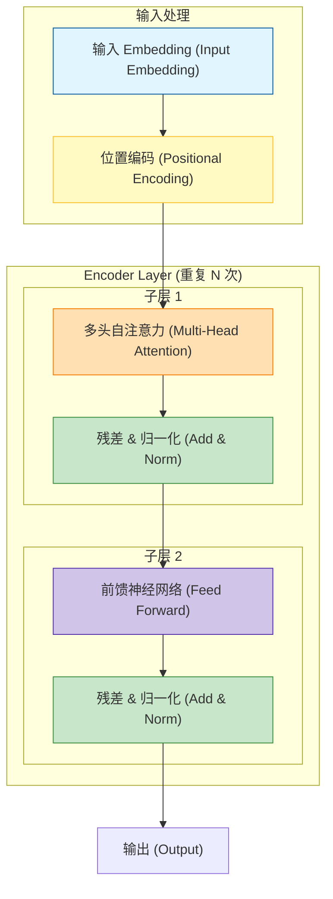

<div style="display: flex; align-items: flex-start;">

<!-- 左侧目录：固定宽度，高度100vh，Sticky定位 -->
<div style="width: 200px; position: sticky; top: 0; height: 100vh; overflow-y: auto; background-color: #f6f8fa; padding: 20px; border-right: 1px solid #d0d7de; flex-shrink: 0;">

<h3 style="margin-top: 0;">📚 目录导航</h3>

1. [任务概述](#1-任务概述)
2. [论文精读](#2-attention-is-all-you-need-精读)
    - [背景与痛点](#21-背景与痛点)
    - [核心架构](#22-transformer-核心架构)
3. [Self-Attention](#3-self-attention-核心公式手推)
    - [公式详解](#31-公式推导与图解)
    - [缩放因子](#32-为什么要除以根号dk)
    - [Q/K/V类比](#33-q-k-v-的通俗理解)
4. [Encoder 结构](#4-transformer-encoder-结构图)
    - [结构可视化](#41-encoder-流程图-mermaid)
5. [代码实现](#5-pytorch-代码实现-code)
6. [核心术语表](#6-核心术语表)

</div>

<!-- 右侧正文：自适应宽度 -->
<div style="flex-grow: 1; padding: 20px; min-width: 0;">

# 第13周学习笔记：Transformer 原理精读

## 1. 任务概述
*   **目标**：深入理解大模型基石——Transformer 架构。
*   **核心资料**：论文《Attention Is All You Need》。
*   **产出**：掌握 Self-Attention 计算细节，绘制 Encoder 结构图。

---

## 2. Attention Is All You Need 精读

### 2.1 背景与痛点
在 Transformer 出现之前，NLP 主流是 **RNN/LSTM**。
*   **RNN 的痛点**：无法并行计算（必须等上一个词处理完才能处理下一个），长距离依赖问题（句子太长时，前面的信息容易丢失）。
*   **Transformer 的突破**：
    1.  **完全抛弃 RNN**：只用 Attention 机制。
    2.  **并行计算**：一次性输入整个句子，训练速度极快。
    3.  **全局视野**：Self-Attention 让每个词都能“看到”句子中的其他所有词，无论距离多远。

### 2.2 Transformer 核心架构
Transformer 是一个 **Encoder-Decoder**（编码器-解码器）结构。
*   **Encoder**：负责理解输入（如：把中文句子读懂，提取特征）。
*   **Decoder**：负责生成输出（如：根据理解的特征，生成英文翻译）。
*   **GPT vs BERT**：
    *   **BERT** 使用了 Encoder 部分（擅长理解）。
    *   **GPT** 使用了 Decoder 部分（擅长生成）。
### 2.3 第一性原理视角：为什么是 Transformer？

如果我们剥离掉所有复杂的数学公式，Transformer 的设计哲学其实是回归到了**信息处理的本质**。

#### 1. 摒弃“顺序”，拥抱“关系”
*   **旧范式 (RNN)**：基于**时间步 (Time Step)**。必须先处理 $t_1$，才能处理 $t_2$。
    *   *缺陷*：就像传声筒游戏，句子越长，排在前面的信息传到后面就越模糊（长距离依赖丢失）。
*   **新范式 (Transformer)**：基于**关系 (Relation)**。
    *   *洞察*：句子中词与词的关系，与它们在句子里的物理距离无关。
    *   *例子*：“**苹果**即使放进冰箱里过了三天也依然很**甜**。”
    *   *Transformer 做法*：让“甜”这个词直接与“苹果”建立强连接，完全无视中间隔了多少个字。这就是 **Self-Attention** 的本质——**万物互联**。

#### 2. 信息压缩 vs. 信息路由
*   **RNN** 试图把前面所有读过的内容都压缩进一个固定大小的“隐藏状态 (Hidden State)”里。这就像让一个人把整本书的内容背下来，压力巨大。
*   **Attention** 不压缩信息，而是建立**索引**。
    *   它不强求记住所有细节，而是记住“如果我想知道味道，该去看哪个词（苹果）”。
    *   $Q, K, V$ 机制就是一套**高级的数据库查询系统**：用 $Q$（查询）去匹配 $K$（索引），提取出 $V$（内容）。

#### 3. 串行 vs. 并行
*   **RNN** 是流水线作业，一个人干完传给下一个人。
*   **Transformer** 是矩阵运算。计算机最擅长做什么？**矩阵乘法**。
*   Transformer 的设计天然契合 GPU 的硬件特性，它把文本理解变成了一个巨大的矩阵乘法问题，从而实现了效率的指数级飞跃。

**一句话总结：Transformer 不是在“读”句子，而是在计算句子内部的引力场。**
---

## 3. Self-Attention 核心公式手推

### 3.1 公式推导与图解
Self-Attention 的核心公式如下：

$$
\text{Attention}(Q, K, V) = \text{softmax}\left(\frac{QK^T}{\sqrt{d_k}}\right)V
$$

**步骤解析：**
1.  **$QK^T$ (相似度计算)**：
    *   Query ($Q$) 和 Key ($K$) 进行点积运算。
    *   结果是一个矩阵，表示**每个词与其他所有词的相关性分数**（Score）。
2.  **$/ \sqrt{d_k}$ (缩放 Scaling)**：
    *   将分数除以 $\sqrt{d_k}$（向量维度的平方根）。
    *   **目的**：防止点积结果过大，导致 Softmax 进入梯度极小的饱和区（梯度消失）。
3.  **Softmax (归一化)**：
    *   将分数转换为概率分布（和为 1）。
    *   分数越高的词，对应的权重越大。
4.  **$\times V$ (加权求和)**：
    *   用计算出的权重去乘以 Value ($V$)。
    *   得到最终的加权特征向量（关注度高的词，其信息会被更多地保留）。

### 3.2 为什么要除以根号dk？
假设 $Q$ and $K$ 的分量是均值为 0，方差为 1 的独立随机变量。
那么点积 $Q \cdot K$ 的均值为 0，方差为 $d_k$。
如果不除以 $\sqrt{d_k}$，随着维度 $d_k$ 增大，点积结果的方差会变得非常大。
这会导致 Softmax 的输出非 0 即 1（极度尖锐），反向传播时**梯度几乎为 0**，模型无法训练。

### 3.3 Q, K, V 的通俗理解
| 符号 | 全称 | 中文 | 类比解释 |
| :--- | :--- | :--- | :--- |
| **Q** | Query | 查询 | **“我想找什么？”**（比如我在淘宝搜“跑鞋”） |
| **K** | Key | 键 | **“这里有什么？”**（淘宝商品库里的标签：跑鞋、皮鞋、拖鞋...） |
| **V** | Value | 值 | **“内容是什么？”**（商品的具体信息：图片、价格、描述） |

**过程**：用 Q 去和所有的 K 比对，看哪个匹配度高（Attention Score），匹配度高就多拿一点对应的 V。

---

## 4. Transformer Encoder 结构图

### 4.1 Encoder 流程图 (Mermaid)


### 4.2 Encoder 结构通俗版（职场开会类比）

想象 **Encoder** 是一个负责阅读文件并写摘要的**文书团队**。输入一句话，就是丢给他们一份文件。

| 专有名词 | 职场角色/动作 | 详细剧情 |
| :--- | :--- | :--- |
| **Input Embedding** | **翻译员** | 把人类语言（文字）翻译成团队能看懂的**数字代码**。 |
| **Positional Encoding** | **贴页码** | 文件本来是散乱的，文员给每一页**贴上页码**（1, 2, 3...），这样大家才知道哪页在前，哪页在后。 |
| **Multi-Head Attention** | **分组讨论** | 团队分成 8 个小组（8个头）。<br>一组负责看**语法**，一组负责看**指代关系**（比如“它”指代谁），一组负责看**情感**...<br>大家同时读，各看各的，效率极高。 |
| **Add (Residual)** | **保留原稿** | 小组讨论后的笔记（Attention 输出）可能不完整，所以要把**原始文件**（输入）也夹在笔记里，防止改得面目全非。 |
| **Norm (LayerNorm)** | **格式统一** | 不同小组写的笔记格式乱七八糟，秘书把所有人的笔记**整理成标准格式**，方便下一轮处理。 |
| **Feed Forward (FFN)** | **脑补/推理** | 这是个**资深专家**。他拿到整理好的笔记，结合自己的知识库进行**深度思考和推理**，提取出更深层的含义。 |
| **Output** | **最终摘要** | 经过 N 轮（通常是 6 轮）这样的处理，最后输出一份包含所有细节精华的**高维特征向量**。 |

**总结流程：**
1.  **翻译+贴页码**（Embedding + Positional）
2.  **分组找重点**（Multi-Head Attention）
3.  **整理归档**（Add & Norm）
4.  **专家思考**（Feed Forward）
5.  **再整理归档**（Add & Norm）
6.  **重复 6 次**，得到最终结果。
---

## 5. PyTorch 代码实现 (Code)

为了加深理解，我们用 PyTorch 实现最核心的 **Scaled Dot-Product Attention**。

```python
import torch
import torch.nn.functional as F
import math

def scaled_dot_product_attention(query, key, value, mask=None):
    """
    Args:
        query: [batch_size, heads, seq_len, d_k]
        key:   [batch_size, heads, seq_len, d_k]
        value: [batch_size, heads, seq_len, d_v]
        mask:  [batch_size, 1, 1, seq_len] (可选)
    """
    d_k = query.size(-1) # 获取维度 dk
    
    # 1. 计算 Attention Score (Q * K^T)
    # transpose(-2, -1) 是把最后两个维度交换，即转置
    scores = torch.matmul(query, key.transpose(-2, -1)) 
    
    # 2. 缩放 (Scaling)
    scores = scores / math.sqrt(d_k)
    
    # 3. Mask (如果有，比如在 Decoder 中防止偷看后面)
    if mask is not None:
        scores = scores.masked_fill(mask == 0, -1e9)
    
    # 4. Softmax 归一化
    attention_weights = F.softmax(scores, dim=-1)
    
    # 5. 加权求和 (Weights * V)
    output = torch.matmul(attention_weights, value)
    
    return output, attention_weights
```

---

## 6. 核心术语表

| 英文 | 中文 | 解释 |
| :--- | :--- | :--- |
| **Transformer** | 变形金刚/变换器 | Google 2017年提出的基于注意力机制的深度学习模型，NLP领域的里程碑。 |
| **Self-Attention** | 自注意力机制 | 模型在处理一个词时，自动关注句子中其他相关词的能力。 |
| **Multi-Head Attention** | 多头注意力 | 让模型用多组 Q/K/V 去“看”不同的特征（比如一组头关注语法，一组头关注语义）。 |
| **Positional Encoding** | 位置编码 | 因为 Transformer 并行输入没有顺序概念，必须手动加上位置信息，告诉模型哪个词在前，哪个在后。 |
| **Residual Connection** | 残差连接 | $x + \text{Layer}(x)$，防止网络过深导致退化，让梯度能顺畅传播。 |
| **Layer Normalization** | 层归一化 | 对每一层的数据进行标准化处理，加速收敛，稳定训练。 |

</div>
</div>