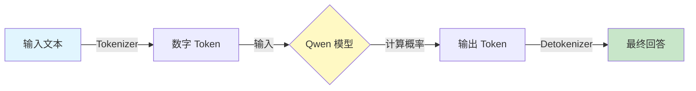

<div style="display: flex; align-items: flex-start;">

<!-- 左侧目录 -->
<div style="width: 200px; position: sticky; top: 0; height: 100vh; overflow-y: auto; background-color: #f6f8fa; padding: 20px; border-right: 1px solid #d0d7de; flex-shrink: 0;">

<h3 style="margin-top: 0;">📚 目录导航</h3>

1. [快速开始](#1-快速开始-mvp)
2. [环境安装](#2-环境安装-setup)
3. [核心代码](#3-核心代码实现-code)
4. [原理解析](#4-核心原理解析-concept)
    - [流程图](#41-推理流程可视化)
    - [组件解释](#42-关键组件类比)
5. [常见问题](#5-常见问题-faq)

</div>

<!-- 右侧正文 -->
<div style="flex-grow: 1; padding: 20px; min-width: 0;">

# 第14-15周：Hugging Face 模型加载与推理

## 1. 快速开始 (MVP)
**目标**：在 10 分钟内跑通 Qwen-0.5B 模型，生成第一句中文回答。

*   **模型选择**：`Qwen-0.5B` (仅 5 亿参数，CPU 也能秒级运行，极简主义首选)。
*   **下载源**：`ModelScope` (阿里魔搭社区)，**不需要科学上网**，国内速度极快。

---

## 2. 环境安装 (Setup)

请在终端中依次执行以下命令：

```bash
# 1. 升级 pip (好习惯)
python -m pip install --upgrade pip

# 2. 安装核心依赖
# modelscope: 国内下载模型神器
# transformers: 即使是 ModelScope 加载，底层也依赖它
# accelerate: 优化模型加载和推理速度
pip install modelscope transformers accelerate
```

---

## 3. 核心代码实现 (Code)

请新建文件 `run_qwen.py` 并填入以下代码。

```python
from modelscope import AutoModelForCausalLM, AutoTokenizer

# 1. 加载分词器：把 "你好" 变成 [108386, 103924]
# trust_remote_code=True: 允许运行模型自带的自定义代码
tokenizer = AutoTokenizer.from_pretrained("qwen/Qwen-0.5B", trust_remote_code=True)

# 2. 加载模型：大脑实体
model = AutoModelForCausalLM.from_pretrained("qwen/Qwen-0.5B", device_map="cpu", trust_remote_code=True)

# 3. 推理测试
input_text = "人工智能未来会取代人类吗？"
inputs = tokenizer(input_text, return_tensors="pt")
pred = model.generate(**inputs, max_new_tokens=200)
print(tokenizer.decode(pred.cpu()[0], skip_special_tokens=True))
```

**运行命令：**
```bash
python run_qwen.py
```

---

## 4. 核心原理解析 (Concept)

### 4.1 推理流程可视化



### 4.2 关键组件类比

| 组件 | 代码对象 | 现实类比 | 功能 |
| :--- | :--- | :--- | :--- |
| **Tokenizer** | `AutoTokenizer` | **翻译官** | 负责在“人类语言”和“机器数字”之间互译。 |
| **Model** | `AutoModelForCausalLM` | **大脑** | 只有它能进行思考（计算），但不认识字，只认识数字。 |
| **ModelScope** | `modelscope` | **国内书店** | 相比 Hugging Face (国外总店)，这里下载速度快，不卡顿。 |

---

## 5. 常见问题 (FAQ)

**Q1: 为什么要用 `trust_remote_code=True`?**
*   **A**: Qwen (千问) 包含一些特殊的模型结构代码，还没完全合并到 `transformers` 官方库里，所以必须允许运行远程仓库里的代码。

**Q2: 第一次运行为什么这么慢？**
*   **A**: 第一次需要下载模型文件（约 1-2 GB）。从第二次开始，它会直接读取本地缓存，速度会飞快。

**Q3: 报错 `ImportError: ...`?**
*   **A**: 通常是缺包。检查是否安装了 `torch`。如果没有，请执行 `pip install torch`。

</div>
</div>