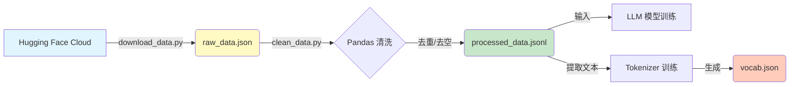

<div style="display: flex; align-items: flex-start;">

<!-- 左侧目录 -->
<div style="width: 200px; position: sticky; top: 0; height: 100vh; overflow-y: auto; background-color: #f6f8fa; padding: 20px; border-right: 1px solid #d0d7de; flex-shrink: 0;">

<h3 style="margin-top: 0;">📚 目录导航</h3>

1. [任务概览](#1-任务概览-overview)
2. [准备工作](#2-准备工作-setup)
3. [数据下载](#3-数据下载-download)
4. [数据清洗](#4-数据清洗-cleaning)
5. [Tokenizer训练](#5-tokenizer-训练-optional)
6. [原理解析](#6-原理解析-concept)
    - [数据流转图](#61-数据流转可视化-mermaid)
    - [BPE原理](#62-bpe-分词原理)

</div>

<!-- 右侧正文 -->
<div style="flex-grow: 1; padding: 20px; min-width: 0;">

# 第16-17周：数据预处理与 Tokenizer 实战

## 1. 任务概览 (Overview)

在大模型训练流程中，**数据质量决定了模型的上限**。本周我们模拟真实的数据准备流程。

*   **目标**：构建一份高质量的指令微调（Instruction Tuning）数据集。
*   **输入**：开源数据集 `alpaca_chinese` (原始脏数据)。
*   **输出**：`processed_data.jsonl` (清洗后的黄金数据) + 自定义 `Tokenizer`。

---

## 2. 准备工作 (Setup)

我们需要安装处理数据常用的库。

```bash
# datasets: Hugging Face 官方数据加载库
# pandas: 强大的数据分析库，清洗神器
# tokenizers: 训练分词器的库 (Rust内核，超快)
pip install datasets pandas tokenizers
```

---

## 3. 数据下载 (Download)

国内网络直接访问 Hugging Face 可能会失败，我们需要配置镜像并编写下载脚本。

### 📄 代码实现：`download_data.py`

```python
import os
from datasets import load_dataset

# 🚀 关键：设置 HF 镜像，解决网络问题
os.environ["HF_ENDPOINT"] = "https://hf-mirror.com"

def download_alpaca_data():
    print("🚀 开始下载 alpaca_chinese 数据集...")
    # 加载数据集
    dataset = load_dataset("qingxu98/alpaca_chinese", split="train")
    
    # 保存原始数据
    dataset.to_json("raw_data.json", force_ascii=False, indent=4)
    print(f"✅ 下载完成！已保存 raw_data.json")

if __name__ == "__main__":
    download_alpaca_data()
```

### ▶️ 运行
```bash
python download_data.py
```

---

## 4. 数据清洗 (Cleaning)

原始数据可能包含：
1.  **重复数据**：浪费训练时间。
2.  **异常数据**：为空或格式错误。
3.  **格式转换**：训练框架通常需要 `jsonl` 格式。

### 📄 代码实现：`clean_data.py`

```python
import pandas as pd

def clean_data():
    # 1. 读取
    df = pd.read_json("raw_data.json")
    print(f"原始数量: {len(df)}")
    
    # 2. 清洗
    # 去重
    df = df.drop_duplicates(subset=['instruction', 'input'])
    # 去空
    df = df.dropna(subset=['output'])
    # 过滤过短回答
    df = df[df['output'].str.len() > 1]
    
    print(f"清洗后数量: {len(df)}")
    
    # 3. 保存为 JSONL
    df.to_json("processed_data.jsonl", orient='records', lines=True, force_ascii=False)
    print("✅ 已保存 processed_data.jsonl")

if __name__ == "__main__":
    clean_data()
```

### ▶️ 运行与验收
```bash
python clean_data.py
```
**验收标准**：检查当前目录下生成的 `processed_data.jsonl` 文件，确保包含 1000+ 条数据，且每行都是一个完整的 JSON。

---

## 5. Tokenizer 训练 (Optional)

**为什么需要自定义 Tokenizer？**
通用 Tokenizer（如 GPT-4 的）在特定领域（如古文、医学代码）可能效率低下。训练自己的 Tokenizer 可以让模型“读”得更准。

### 📄 代码实现：`train_tokenizer.py`

```python
from tokenizers import Tokenizer, models, trainers, pre_tokenizers

# 1. 初始化 BPE 模型
tokenizer = Tokenizer(models.BPE())
tokenizer.pre_tokenizer = pre_tokenizers.ByteLevel(add_prefix_space=False)

# 2. 配置训练器
trainer = trainers.BpeTrainer(
    vocab_size=10000,  # 词表大小
    special_tokens=["<PAD>", "<UNK>", "<BOS>", "<EOS>"]
)

# 3. 训练 (使用我们清洗好的数据)
# 提取文本生成临时语料文件略... (见完整脚本)
tokenizer.train(["tokenizer_corpus.txt"], trainer)

# 4. 保存
tokenizer.save("my_custom_tokenizer.json")
```

### ▶️ 运行
```bash
python train_tokenizer.py
```

---

## 6. 原理解析 (Concept)

### 6.1 数据流转可视化 (Mermaid)



### 6.2 BPE 分词原理
**BPE (Byte-Pair Encoding)** 是一种统计分词方法。
1.  **初始状态**：把所有词拆成字母。`h u g`, `p u g`
2.  **统计频率**：发现 `u` 和 `g` 经常一起出现。
3.  **合并**：创造新 token `ug`。
4.  **迭代**：现在有 `h ug`, `p ug`。继续统计...
5.  **结果**：高频词（如 `ing`, `tion`）被合并成一个 token，生僻词保留为字母序列。

**好处**：
*   **词表可控**：不会无限膨胀。
*   **无 OOV 问题**：任何生词都能由基础字符拼出来。

</div>
</div>
