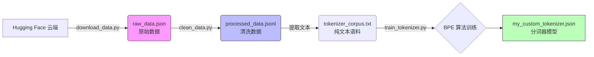

<div style="display: flex; align-items: flex-start;">

<!-- 左侧目录 -->
<div style="width: 200px; position: sticky; top: 0; height: 100vh; overflow-y: auto; background-color: #f6f8fa; padding: 20px; border-right: 1px solid #d0d7de; flex-shrink: 0;">

<h3 style="margin-top: 0;">📚 目录导航</h3>

1. [核心任务](#1-核心任务)
2. [技术术语表](#2-技术术语表)
3. [文件清单与作用](#3-文件清单与作用)
4. [流程可视化](#4-流程可视化)
5. [详细操作步骤](#5-详细操作步骤)
   - [下载数据](#51-下载数据)
   - [数据清洗](#52-数据清洗)
   - [训练 Tokenizer](#53-训练-tokenizer)
6. [遇到的坑与解决](#6-遇到的坑与解决)

</div>

<!-- 右侧正文 -->
<div style="flex-grow: 1; padding: 20px; min-width: 0;">

# 第16-17周学习笔记：数据预处理与 Tokenizer 训练

## 1. 核心任务

本周主要完成了大模型训练前的准备工作：**数据预处理**和**分词器（Tokenizer）训练**。
这是从“使用模型”进阶到“训练模型”的关键一步。模型不懂中文，也不懂英文，它只认识数字。Tokenizer 的作用就是把人类语言高效地转换成模型能读懂的数字序列。

## 2. 技术术语表

| 英文 Term | 中文 | 极简解释 | 
| :--- | :--- | :--- |
| **Tokenizer** | 分词器 | 翻译官。把“我爱AI”切分成“我”、“爱”、“AI”，然后转成数字 [101, 203, 305]。 |
| **Corpus** | 语料库 | 模型的课本。一大堆用来训练的文本数据。 |
| **BPE (Byte-Pair Encoding)** | 字节对编码 | 一种智能分词算法。它不按单词切，而是把常见的字组合在一起（如“人工”+“智能”），生僻字拆开。效率高，词表小。 |
| **JSONL** | JSON Lines | 每行一个 JSON 对象的文件格式。比普通 JSON 更适合处理海量数据，因为可以读一行处理一行，不占内存。 |
| **Vocab Size** | 词表大小 | 翻译官认识的单词总量。本次设置为 10,000。 |

## 3. 文件清单与作用

所有文件均已归档至 `第16_17周` 文件夹下。

| 文件名 | 类型 | 作用 |
| :--- | :--- | :--- |
| `raw_data.json` | **原始数据** | 从 Hugging Face 下载下来的初始数据。包含指令、输入和输出，但可能存在重复、空值或格式问题。 |
| `processed_data.jsonl` | **清洗后数据** | 经过代码去重、去空、格式化后的“干净”数据。每行一条，适合模型读取。 |
| `tokenizer_corpus.txt` | **训练语料** | 专门提取出来的纯文本文件（只包含文字）。用来喂给 Tokenizer 学习如何分词。 |
| `my_custom_tokenizer.json` | **模型文件** | **最终产物**。训练好的 Tokenizer 模型，里面记录了它学会的 10,000 个词汇和编码规则。 |
| `download_data.py` | 脚本 | 负责从网络下载数据并保存。 |
| `clean_data.py` | 脚本 | 负责把脏数据变成干净数据。 |
| `train_tokenizer.py` | 脚本 | 负责读取文本，训练出 Tokenizer 模型。 |

## 4. 流程可视化



## 5. 详细操作步骤

### 5.1 下载数据
由于 Hugging Face 国内访问不稳定，我们采取了灵活策略。如果设置镜像无效，直接开启科学上网工具即可。

**代码 (`download_data.py`):**
```python
import os
from datasets import load_dataset
import json

def download_alpaca_data():
    print("🚀 开始下载 alpaca_chinese 数据集...")
    
    # 替换为更稳定的数据集源：silk-road/alpaca-data-gpt4-chinese
    dataset = load_dataset("silk-road/alpaca-data-gpt4-chinese", split="train")
    
    # 使用绝对路径，确保文件生成在脚本同级目录
    output_file = os.path.join(os.path.dirname(__file__), "raw_data.json")
    
    # 保存为标准 JSON 列表格式
    with open(output_file, 'w', encoding='utf-8') as f:
        json.dump(list(dataset), f, ensure_ascii=False, indent=4)
        
    print(f"💾 原始数据已保存到: {output_file}")

if __name__ == "__main__":
    download_alpaca_data()
```

### 5.2 数据清洗
清洗是数据科学中最耗时但最重要的步骤。垃圾进，垃圾出 (Garbage In, Garbage Out)。

**清洗逻辑：**
1.  **读取**：兼容标准 JSON 和 JSONL 格式。
2.  **去重**：删除完全一样的指令。
3.  **去空**：删除缺少回答的数据。
4.  **保存**：转存为 `JSONL` 格式，方便流式读取。

**代码 (`clean_data.py`):**
```python
import json
import pandas as pd
import os

def clean_data():
    base_dir = os.path.dirname(__file__)
    input_file = os.path.join(base_dir, "raw_data.json")
    output_file = os.path.join(base_dir, "processed_data.jsonl")
    
    # 读取数据
    try:
        df = pd.read_json(input_file)
    except ValueError:
        df = pd.read_json(input_file, lines=True)
    
    # 去重与去空
    df_clean = df.drop_duplicates(subset=['instruction', 'input'])
    df_clean = df_clean.dropna(subset=['instruction', 'output'])
    df_clean = df_clean[df_clean['output'].str.len() > 1]
    
    # 保存为 JSONL
    df_clean.to_json(output_file, orient='records', lines=True, force_ascii=False)
    print(f"✅ 清洗完成！已保存到: {output_file}")

if __name__ == "__main__":
    clean_data()
```

### 5.3 训练 Tokenizer
使用 Hugging Face 的 `tokenizers` 库训练一个 BPE 分词器。

**关键参数：**
*   `vocab_size=10000`: 词表大小。
*   `min_frequency=2`: 出现少于2次的词会被忽略（降噪）。
*   `special_tokens`: 特殊标记，如 `<PAD>` (补全), `<EOS>` (句尾)。

**代码 (`train_tokenizer.py`):**
```python
from tokenizers import Tokenizer, models, pre_tokenizers, trainers, decoders
import json
import os

def train_custom_tokenizer():
    base_dir = os.path.dirname(__file__)
    input_file = os.path.join(base_dir, "processed_data.jsonl")
    corpus_file = os.path.join(base_dir, "tokenizer_corpus.txt")
    
    # 1. 提取语料
    with open(input_file, "r", encoding="utf-8") as f_in, \
         open(corpus_file, "w", encoding="utf-8") as f_out:
        for line in f_in:
            data = json.loads(line)
            f_out.write(data["instruction"] + "\n")
            f_out.write(data["output"] + "\n")
            
    # 2. 训练 Tokenizer
    tokenizer = Tokenizer(models.BPE())
    tokenizer.pre_tokenizer = pre_tokenizers.ByteLevel(add_prefix_space=False)
    
    trainer = trainers.BpeTrainer(
        vocab_size=10000, 
        min_frequency=2,
        special_tokens=["<PAD>", "<UNK>", "<BOS>", "<EOS>"]
    )
    
    tokenizer.train([corpus_file], trainer)
    tokenizer.save(os.path.join(base_dir, "my_custom_tokenizer.json"))
    print("✅ Tokenizer 训练完成！")

if __name__ == "__main__":
    train_custom_tokenizer()
```

## 6. 遇到的坑与解决

1.  **HF 镜像无效**：
    *   **现象**：设置了 `HF_ENDPOINT` 仍然下载失败或超时。
    *   **解决**：最直接的办法是**开启科学上网**，并注释掉代码中的镜像设置。

2.  **数据格式混乱**：
    *   **现象**：`dataset.to_json(indent=4)` 会生成非法的 JSONL 格式（带缩进但没逗号），导致 Pandas 读取报错。
    *   **解决**：放弃 `to_json`，使用 `json.dump(list(dataset))` 手动保存为标准 JSON 数组格式。

3.  **路径问题**：
    *   **现象**：脚本在不同目录下运行，生成的文件位置乱跑。
    *   **解决**：使用 `os.path.join(os.path.dirname(__file__), "文件名")` 锁定文件路径为脚本所在目录。

</div>
</div>
