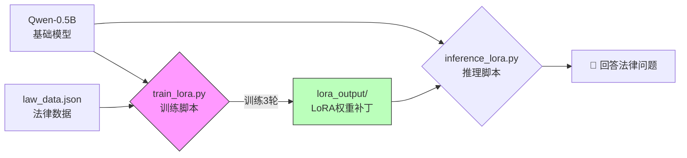

<div style="display: flex; align-items: flex-start;">

<!-- 左侧目录 -->
<div style="width: 200px; position: sticky; top: 0; height: 100vh; overflow-y: auto; background-color: #f6f8fa; padding: 20px; border-right: 1px solid #d0d7de; flex-shrink: 0;">

<h3 style="margin-top: 0;">📚 目录导航</h3>

1. [核心任务](#1-核心任务)
2. [技术术语表](#2-技术术语表)
3. [文件清单与作用](#3-文件清单与作用)
4. [流程可视化](#4-流程可视化)
5. [详细操作步骤](#5-详细操作步骤)
   - [准备数据](#51-准备数据)
   - [开始训练](#52-开始训练)
   - [模型推理](#53-模型推理)
6. [遇到的坑与解决](#6-遇到的坑与解决)
7. [结果分析](#7-结果分析)

</div>

<!-- 右侧正文 -->
<div style="flex-grow: 1; padding: 20px; min-width: 0;">

# 第18-19周学习笔记：LoRA 微调实战

## 1. 核心任务

本周主要完成了大模型的 **LoRA 微调 (Fine-tuning)**。
我们没有从头训练一个大模型（那需要几百万美元），而是使用 **PEFT** 技术，在一个基础模型（Qwen-0.5B）上“外挂”了一个小型的知识库（LoRA权重），让它学会了回答法律相关的问题。

## 2. 技术术语表

| 英文 Term | 中文 | 极简解释 |
| :--- | :--- | :--- |
| **Fine-tuning** | 微调 | 进修。让通用的大学生模型（基础模型）去学法律专业课，变成律师。 |
| **LoRA** | 低秩适配 | **打补丁**。不改动模型原来的亿万参数，只训练一个小小的附加模块。省显存，速度快，效果好。 |
| **PEFT** | 参数高效微调 | **花小钱办大事**。LoRA 就是 PEFT 的一种核心技术。 |
| **Epoch** | 轮次 | **看书的遍数**。把所有训练数据完整学一遍叫一个 Epoch。本次我们学了 3 遍。 |
| **Gradient Checkpointing** | 梯度检查点 | **空间换时间**。一种节省显存的黑科技，能让小显卡也能跑大模型训练。 |
| **Overfitting** | 过拟合 | **死记硬背**。书看太多遍（Epoch 太多），只会背书上的原题，不会做变通的新题。 |

## 3. 文件清单与作用

所有文件均已归档至 `第18_19周` 文件夹下。

| 文件名 | 类型 | 作用 |
| :--- | :--- | :--- |
| `law_data.json` | **训练数据** | 我们的“法律教材”。包含若干条法律问答对（Instruction/Input/Output）。 |
| `train_lora.py` | **训练脚本** | 核心代码。负责加载基础模型、挂载 LoRA 配置、喂数据进行训练，并保存结果。 |
| `inference_lora.py` | **推理脚本** | 测试代码。加载基础模型 + 训练好的 LoRA 权重，测试它是否学会了法律知识。 |
| `lora_output/` | **输出文件夹** | **最终产物**。里面最重要的文件是 `adapter_model.safetensors`，这就是我们训练出来的“法律补丁”。 |

## 4. 流程可视化



## 5. 详细操作步骤

### 5.1 准备数据 (`law_data.json`)
我们需要准备 Instruction (指令) 格式的数据。
```json
[
    {
        "instruction": "什么是合同法？",
        "input": "",
        "output": "合同法是调整平等主体..."
    }
]
```

### 5.2 开始训练 (`train_lora.py`)
运行脚本开始训练。我们开启了 `gradient_checkpointing` 来节省显存，并设置了 `Epoch=3`。

**关键代码片段：**
```python
# 配置 LoRA
config = LoraConfig(
    task_type=TaskType.CAUSAL_LM, 
    r=8, # LoRA 秩，越大越强但越慢
    lora_alpha=32, 
    lora_dropout=0.1
)

# 开启梯度检查点防止显存爆炸
model.enable_input_require_grads()

# 训练参数
args = TrainingArguments(
    output_dir=output_dir,
    num_train_epochs=3, # 训练3遍
    gradient_checkpointing=True
)
```

### 5.3 模型推理 (`inference_lora.py`)
训练完成后，我们不能直接用原模型，必须把 LoRA 权重加载进去。

**关键代码片段：**
```python
# 1. 加载基础模型
model = AutoModelForCausalLM.from_pretrained(model_id, ...)

# 2. 加载我们训练好的 LoRA 权重
lora_path = "./lora_output"
model = PeftModel.from_pretrained(model, lora_path)

# 3. 提问
prompt = "什么是合同法？"
# ... 生成回答
```

## 6. 遇到的坑与解决

### 坑1：RuntimeError: element 0 of tensors does not require grad
*   **现象**：一运行训练脚本就报错。
*   **原因**：开启了 `gradient_checkpointing`（节省显存），但没有告诉 PyTorch 需要计算输入层的梯度。
*   **解决**：
    在 `train_lora.py` 中添加一行代码：
    ```python
    model.enable_input_require_grads()
    ```

### 坑2：重复训练浪费时间
*   **现象**：每次运行脚本都会重新开始训练，浪费几分钟。
*   **解决**：
    在脚本开头添加检查逻辑：
    ```python
    if os.path.exists(...):
        print("✅ 检测到已存在训练好的模型，跳过训练")
        sys.exit(0)
    ```

## 7. 结果分析
*   **训练前**：问“什么是合同法？”，模型可能胡说八道或者只说些通用的废话。
*   **训练后**：模型能精准背诵出合同法的定义（因为我们在数据里教过它）。
*   **不足**：对于没见过的问法（如“解释一下不可抗力”），模型回答“无法确定”。说明数据量太少，模型泛化能力还不够。
*   **下一步**：增加更多样化的数据，或者增加训练轮次。

</div>
</div>
