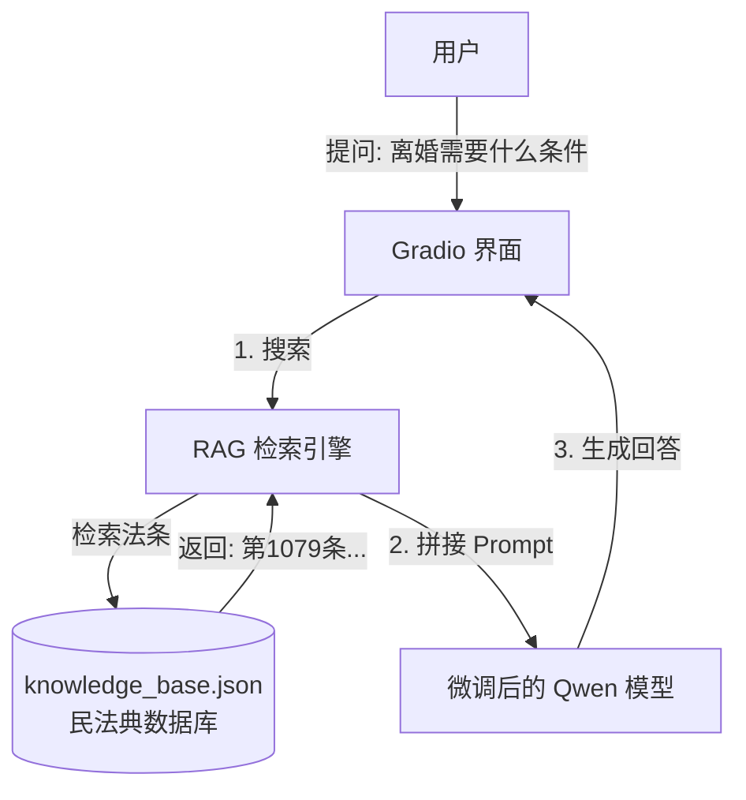

<div style="display: flex; align-items: flex-start;">

<!-- 左侧目录 -->
<div style="width: 200px; position: sticky; top: 0; height: 100vh; overflow-y: auto; background-color: #f6f8fa; padding: 20px; border-right: 1px solid #d0d7de; flex-shrink: 0;">

<h3 style="margin-top: 0;">📚 目录导航</h3>

1. [项目概览](#1-项目概览)
2. [技术架构](#2-技术架构)
3. [详细操作步骤](#3-详细操作步骤)
   - [环境安装](#31-环境安装)
   - [知识库准备](#32-知识库准备)
   - [编写 RAG 引擎](#33-编写-rag-引擎)
   - [编写 Gradio 界面](#34-编写-gradio-界面)
   - [运行与测试](#35-运行与测试)
4. [验证目标](#4-验证目标)

</div>

<!-- 右侧正文 -->
<div style="flex-grow: 1; padding: 20px; min-width: 0;">

# 第22-24周：法律问答机器人 (RAG + 微调 + Gradio)

## 1. 项目概览

这是本课程的**最终大作业**。我们将结合之前学到的所有技能，打造一个真正的 AI 应用。

*   **核心痛点**：大模型虽然懂很多，但法律条款更新快、细节多，模型容易“产生幻觉”（胡说八道）。
*   **解决方案**：**RAG (检索增强生成)**。
    *   在回答之前，先去“法条库”里查阅相关资料。
    *   把查到的资料扔给模型：“请根据这些资料回答用户问题”。
    *   这样回答既专业又有据可依。

## 2. 技术架构



## 3. 详细操作步骤

### 3.1 环境安装

我们需要安装 `gradio` (做界面) 和 `sentence-transformers` (做搜索，计算文本相似度)。

1.  在 `第22_24周` 目录下创建 `requirements.txt`：
    ```text
    gradio
    sentence-transformers
    numpy
    torch
    transformers
    peft
    ```
2.  安装依赖：
    ```powershell
    pip install -r 第22_24周/requirements.txt
    ```

### 3.2 知识库准备

我们需要构建一个简单的法律数据库。为了演示，我们创建一个 JSON 文件。

1.  在 `第22_24周` 目录下创建 `knowledge_base.json`：
    ```json
    [
        {
            "id": 1,
            "content": "《民法典》第一千零七十六条：夫妻双方自愿离婚的，应当签订书面离婚协议，并亲自到婚姻登记机关申请离婚登记。"
        },
        {
            "id": 2,
            "content": "《民法典》第一千零七十九条：夫妻一方要求离婚的，可以由有关组织进行调解或者直接向人民法院提起离婚诉讼。有下列情形之一，调解无效的，应当准予离婚：(一)重婚或者与他人同居；(二)实施家庭暴力或者虐待、遗弃家庭成员；(三)有赌博、吸毒等恶习屡教不改；(四)因感情不和分居满二年；(五)其他导致夫妻感情破裂的情形。"
        },
        {
            "id": 3,
            "content": "《民法典》第一千零八十五条：离婚后，子女由一方直接抚养的，另一方应当负担部分或者全部抚养费。"
        }
    ]
    ```

### 3.3 编写 RAG 引擎 (`rag_engine.py`)

创建一个 Python 脚本，专门负责“搜”。

```python
import json
import numpy as np
from sentence_transformers import SentenceTransformer

class LawRAG:
    def __init__(self, json_path):
        print("📥 正在加载知识库...")
        with open(json_path, 'r', encoding='utf-8') as f:
            self.knowledge = json.load(f)
        
        # 提取所有文本
        self.corpus = [item['content'] for item in self.knowledge]
        
        print("🧠 正在加载检索模型 (moka-ai/m3e-small)...")
        # 使用中文效果很好的轻量级嵌入模型
        self.encoder = SentenceTransformer('moka-ai/m3e-small')
        
        print("⚡ 正在构建向量索引...")
        self.corpus_embeddings = self.encoder.encode(self.corpus)

    def search(self, query, top_k=2):
        # 1. 把用户的问题变成向量
        query_embedding = self.encoder.encode(query)
        
        # 2. 计算相似度 (Cosine Similarity)
        # 简单的点积计算
        similarities = np.dot(self.corpus_embeddings, query_embedding)
        
        # 3. 找出最相似的 top_k 个
        top_indices = np.argsort(similarities)[-top_k:][::-1]
        
        results = []
        for idx in top_indices:
            results.append(self.corpus[idx])
            
        return results
```

### 3.4 编写 Gradio 界面 (`app.py`)

这是主程序，整合了 RAG 和我们之前训练好的 LoRA 模型。

```python
import gradio as gr
from transformers import AutoModelForCausalLM, AutoTokenizer
from peft import PeftModel
from rag_engine import LawRAG
import os

# --- 1. 初始化路径 ---
# 请确保这里指向您第18_19周训练好的 lora_output 目录
LORA_PATH = "../第18_19周/lora_output"
BASE_MODEL = "qwen/Qwen1.5-0.5B"

# --- 2. 加载模型 ---
print("🚀 正在加载微调后的 Qwen 模型...")
tokenizer = AutoTokenizer.from_pretrained(BASE_MODEL, trust_remote_code=True)
model = AutoModelForCausalLM.from_pretrained(BASE_MODEL, device_map="auto", trust_remote_code=True)

# 加载 LoRA 权重
if os.path.exists(LORA_PATH):
    print(f"✅ 挂载 LoRA: {LORA_PATH}")
    model = PeftModel.from_pretrained(model, LORA_PATH)
else:
    print("⚠️ 未找到 LoRA 权重，将使用基础模型运行！")

# --- 3. 初始化 RAG ---
rag = LawRAG(os.path.join(os.path.dirname(__file__), "knowledge_base.json"))

# --- 4. 定义对话函数 ---
def chat_response(message, history):
    # Step A: 检索知识
    retrieved_docs = rag.search(message)
    context = "\n".join(retrieved_docs)
    
    # Step B: 构建 Prompt
    prompt = f"""Instruction: 你是一个专业的法律助手。请根据以下参考资料回答用户的问题。
    
参考资料：
{context}

用户问题：
{message}

Output: """

    # Step C: 模型推理
    inputs = tokenizer(prompt, return_tensors="pt").to(model.device)
    pred = model.generate(**inputs, max_new_tokens=256, temperature=0.7)
    response = tokenizer.decode(pred.cpu()[0], skip_special_tokens=True)
    
    # 清理掉 Prompt 部分，只保留回答
    response = response.split("Output:")[-1].strip()
    
    return response

# --- 5. 启动界面 ---
demo = gr.ChatInterface(
    fn=chat_response,
    title="⚖️ AI 法律顾问 (RAG + LoRA)",
    description="基于 Qwen-0.5B 微调，挂载《民法典》知识库。",
    examples=["离婚需要什么条件？", "对方出轨了怎么办？", "抚养费怎么算？"]
)

if __name__ == "__main__":
    demo.launch()
```

### 3.5 运行与测试

1.  **运行**：
    ```powershell
    python 第22_24周/app.py
    ```
2.  **访问**：
    终端会显示一个链接，通常是 `http://127.0.0.1:7860`。按住 Ctrl 点击打开。
3.  **测试**：
    输入“离婚需要什么条件？”，观察它是否引用了《民法典》第一千零七十九条的内容。

## 4. 验证目标

- [ ] **RAG 生效**：回答中包含了具体的法条内容（因为基础模型可能背不下来这么细）。
- [ ] **界面可用**：Gradio 界面美观，交互流畅。
- [ ] **流程跑通**：没有报错，模型成功加载。

</div>
</div>
