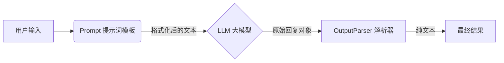

# 第25周学习笔记：LangChain 与国产大模型

## 1. 为什么 Tongyi (Qwen) 不需要科学上网？

你在代码中看到的：
```python
llm = Tongyi(model="qwen-max")
```

**核心原因：这是“国产云端 API”，不是“本地模型下载”。**

| 维度 | Hugging Face / OpenAI | 阿里云 Tongyi (通义千问) |
| :--- | :--- | :--- |
| **提供商** | 美国公司 / 社区 | **中国 阿里云** |
| **服务器位置** | 欧美地区 | **中国大陆** |
| **网络要求** | 通常需要科学上网 | **国内直连，速度极快** |
| **运行方式** | 本地运行需下载 GGUF/权重 (占内存) <br> API 需跨境访问 | **API 模式** (不占本地内存，只发请求) |

### 💡 深入理解 (First Principles)
这里的 `llm = Tongyi(...)` 并没有把几百 GB 的模型下载到你的电脑上。
它只是创建了一个 **“遥控器”**。
*   当你运行 `chain.invoke()` 时，你的电脑发送了一段文字给阿里云。
*   阿里云的服务器算好后，把结果发回给你。
*   因为阿里云服务器就在国内，所以**就像访问百度一样顺畅**。

---

## 2. LangChain 核心架构 (LCEL)

本周我们使用了最新的 **LCEL (LangChain Expression Language)** 语法，这是 LangChain 的未来标准。

### 核心公式
> **Chain = Prompt + LLM + OutputParser**



### 代码映射
```python
# 1. 管道起点：Prompt
prompt = PromptTemplate.from_template("翻译：{text}")

# 2. 管道中枢：LLM
llm = Tongyi(model="qwen-max")

# 3. 管道终点：Parser
parser = StrOutputParser()

# 4. 组装管道 (使用 | 符号)
chain = prompt | llm | parser
```

## 3. 常见报错与修复

| 报错信息 | 原因 | 解决方案 |
| :--- | :--- | :--- |
| `ModuleNotFoundError: No module named 'langchain.chains'` | 旧版代码在新版库中被移除 | 改用 **LCEL** 写法 (即 `|` 管道写法)，并从 `langchain_core` 导入组件。 |
| `DashScopeError: ... api key ...` | 未配置阿里云 Key | 设置环境变量 `$env:DASHSCOPE_API_KEY="sk-..."` |

---

## 4. 本周作业回顾

- [x] **环境搭建**：安装 `langchain` 和 `dashscope`。
- [x] **Hello World**：编写 `simple_chain.py` 完成翻译任务。
- [x] **Web 应用**：使用 Gradio 封装成 `app.py`，制作图形化翻译工具。
