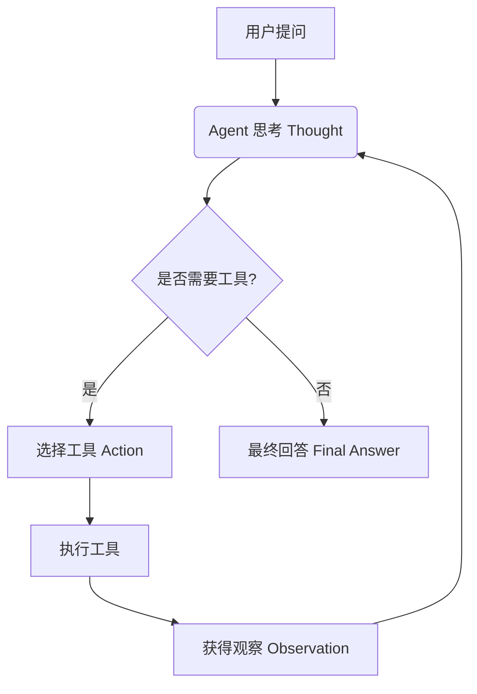

# 第26周学习笔记：构建智能 Agent (智能体)

## 0. 学习思维：逆推路径 (Reverse Engineering)

*思路：我要达成本周的目标，需要学会什么？*

### 第26周：构建智能 Agent（调用工具）

-   **目标** ：创建能调用外部工具的 Agent
-   **任务** ：
    1. 安装工具：`pip install langchain_community`
    2. 实现一个能调用天气 API 的 Agent
    3. 使用例如： `serpapi` 或 `baidu` 作为天气数据源
-   **代码** (实战验证版)：
    ```python
    # 注意：initialize_agent 已在 LangChain 0.2+ 中废弃，以下为新版 create_react_agent 写法
    from langchain.agents import create_react_agent, AgentExecutor
    from langchain_community.llms import Tongyi
    from langchain_core.tools import Tool
    from langchain_core.prompts import PromptTemplate

    # 1. 初始化模型
    llm = Tongyi(model="qwen-max")

    # 2. 定义工具 (示例：模拟天气查询)
    def dummy_weather(location):
        return f"{location} 今天气温 25度，晴朗。"
    
    tools = [Tool(name="Weather", func=dummy_weather, description="查询天气")]

    # 3. 创建 Agent (ReAct 模式)
    template = """Answer the following questions as best you can. You have access to the following tools:
    {tools}
    Use the following format:
    Question: the input question you must answer
    Thought: you should always think about what to do
    Action: the action to take, should be one of [{tool_names}]
    Action Input: the input to the action
    Observation: the result of the action
    ... (this Thought/Action/Action Input/Observation can repeat N times)
    Thought: I now know the final answer
    Final Answer: the final answer to the original input question
    Begin!
    Question: {input}
    Thought:{agent_scratchpad}"""
    
    prompt = PromptTemplate.from_template(template)
    agent = create_react_agent(llm, tools, prompt)

    # 4. 执行
    agent_executor = AgentExecutor(agent=agent, tools=tools, verbose=True)
    agent_executor.invoke({"input": "北京今天的天气怎么样？"})
    ```
-   **验收** ：Agent 能获取并返回北京天气信息

---

## 📖 1. 核心概念：什么是 Agent？

如果说 **LLM (大模型)** 是一个“大脑”，那么 **Agent (智能体)** 就是给这个大脑装上了“手”和“脚”。

*   **纯 LLM (Chat)**：只能陪聊，数据仅限于训练截止日期前。
*   **Agent**：可以使用工具（联网搜索、查天气、操作数据库），能够解决它不知道的问题。

### 🧠 为什么它会有“推理能力”？(ReAct 原理)

你刚才看到的“自我修正”过程，核心源自 **ReAct (Reasoning + Acting)** 框架。这**不是**模型天生就会自动去做的，而是我们通过 **Prompt (提示词)** 引导出来的。

1.  **Qwen-max (大脑)**：提供了强大的逻辑理解和文本生成能力。它足够聪明，能听懂指令。
2.  **ReAct Prompt (指令)**：我们发给模型的 Prompt 其实长这样（简化版）：
    > "请回答用户的问题。如果不知道，请使用工具。
    > 每次行动前，必须先输出 **Thought (思考)**，然后输出 **Action (行动)**。
    > 拿到结果后，观察 **Observation (结果)**，再决定下一步。"

**流程图解：**



---

## 🛠️ 2. 实战复盘：2022 世界杯冠军案例

在本次实战中，我们亲眼见证了 Agent 的**自我修正**能力，这是 Agent 最迷人的地方。

### 📝 原始日志分析

| 步骤 | 环节 | 内容 | 💡 笔记解读 |
| :--- | :--- | :--- | :--- |
| 1 | **思考** | "我需要查找2022年世界杯...获胜队伍" | 拆解任务 |
| 2 | **行动** | 搜索 `2022年世界杯冠军` | 第一次尝试 |
| 3 | **观察** | (返回了一堆杂乱新闻，没直接答案) | **关键点：搜索失败** |
| 4 | **反思** | **"搜索结果似乎没有直接回答... 我需要再次尝试"** | 🤖 **它意识到自己错了！** |
| 5 | **行动** | 搜索 `2022 FIFA World Cup winner` | **策略升级**：换英文搜 |
| 6 | **观察** | "...Argentina defeated France..." | 找到确凿证据 |
| 7 | **最终** | "2022年FIFA世界杯冠军是阿根廷队" | 输出答案 |

**结论**：普通的脚本遇到错误会报错停止，而 Agent 会像人一样**换个方法再试一次**。

---

## 💻 3. 技术栈总结

### 关键组件

1.  **AgentExecutor**：Agent 的运行时环境，负责死循环：`调用大模型 -> 解析结果 -> 执行工具 -> 把结果喂回给大模型`。
2.  **Tools (工具)**：
    *   `WeatherQuery` (自定义函数)：演示了如何让模型调用 Python 函数。
    *   `WebSearch` (LangChain 组件)：演示了如何接入外部 API。
3.  **LLM (Qwen-max)**：负责所有决策。模型越强，Agent 越不容易“发疯”（比如死循环或胡言乱语）。

### 常用搜索方案对比

| 方案 | 优点 | 缺点 | 适用场景 |
| :--- | :--- | :--- | :--- |
| **DuckDuckGo** | 免费，无需 Key | **极不稳定**，需强力 VPN | 学习、测试 |
| **SerpApi (百度)** | **极其稳定**，支持百度 | 收费 (有免费额度) | 生产环境、国内项目 |
| **Bocha (博查)** | 国产，AI 搜索优化好 | 需额外代码集成 | 对搜索质量要求极高时 |

---

## 🚀 4. 创业者思维：Agent 的商业价值

从“第一性原理”来看，Agent 解决的是“**大模型落地的最后一公里**"问题。

*   **以前**：用户问“明天去上海穿什么”，ChatGPT 说“我无法联网”。
*   **现在**：Agent 自动查天气 -> 自动查穿衣指南 -> 综合生成建议。
*   **未来**：Agent 自动查票 -> 自动比价 -> 自动下单。

**一句话总结**：Chatbot 只是陪聊，Agent 才是**数字员工**。