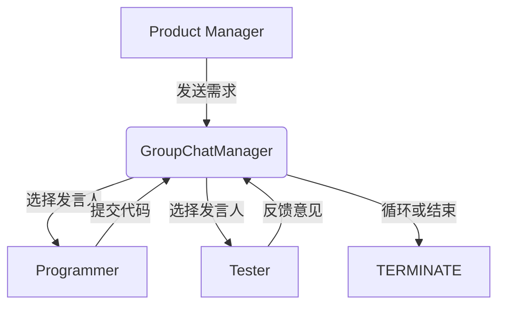
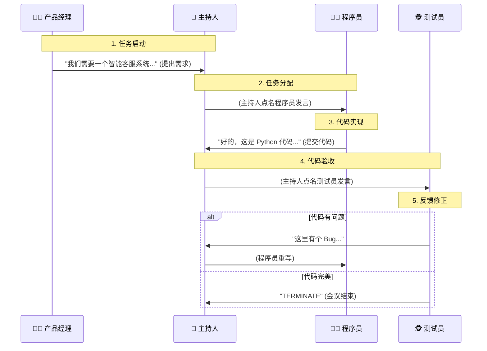

# 第28周操作指南：AutoGen 多智能体协作

本周我们将构建一个由“产品经理”、“程序员”和“测试员”组成的虚拟软件开发团队，体验 AutoGen 的多智能体协作能力。

## 目录
- [🎯 目标](#-目标)
- [⚙️ 任务 1：环境安装](#-任务-1环境安装)
- [💻 任务 2：创建协作脚本](#-任务-2创建协作脚本)
- [🚀 任务 3：运行与观察](#-任务-3运行与观察)
- [🧠 核心概念解析](#-核心概念解析)

---

## 🎯 目标
1.  安装并配置 `pyautogen`。
2.  解决 Qwen (通义千问) 与 AutoGen 的连接配置问题。
3.  跑通一个全自动的“需求 -> 代码 -> 测试”闭环。

---

## ⚙️ 任务 1：环境安装

由于 AutoGen 最近发生了分裂（Microsoft 推出了新版架构，而原团队维护的 Classic 版本改名为 AG2），我们需要安装 **AG2** 版本以保持代码兼容性。

请在终端中执行以下命令：

```powershell
# 1. 彻底卸载旧包（防止冲突）
pip uninstall pyautogen autogen-agentchat autogen-core autogen -y

# 2. 安装 AG2 (包名为 autogen)
# 它完美支持 Python 3.13+ 且保留了经典 API
pip install autogen
```

> **注意**：如果遇到 `numpy` 相关报错，请补充执行 `pip install "numpy<2"`。

---

## 💻 任务 2：创建协作脚本

请在 `第28周` 目录下创建文件 `autogen_demo.py`，并将下方代码完整复制进去。

> **🔧 修正说明**：
> 原代码中的 `llm_config` 无法直接驱动 Qwen。
> 我已将其修改为 **OpenAI 兼容模式** (`base_url` 指向阿里云)，这是目前最稳定的连接方式。

### 📄 `autogen_demo.py`

```python
import os
import autogen

# --- 1. 配置 LLM (核心修改) ---
# AutoGen 使用 OpenAI 兼容接口连接通义千问
config_list = [{
    "model": "qwen-max",
    "api_key": os.environ.get("DASHSCOPE_API_KEY"),
    "base_url": "https://dashscope.aliyuncs.com/compatible-mode/v1"
}]

llm_config = {
    "config_list": config_list,
    "temperature": 0.7,
    "seed": 42, # 设置种子以保证结果可复现
}

print(f"{'='*20} 初始化多智能体团队 {'='*20}")

# --- 2. 定义角色 (Agents) ---

# 👩‍💼 产品经理：负责提需求
product_manager = autogen.AssistantAgent(
    name="Product_Manager",
    system_message="""你是产品经理。
    1. 你负责定义软件需求。
    2. 你需要清晰地描述我们要开发什么产品，包含哪些核心功能。
    3. 看到代码后，如果符合需求，请不要说话，让测试员去测。""",
    llm_config=llm_config
)

# 👨‍💻 程序员：负责写代码
programmer = autogen.AssistantAgent(
    name="Programmer",
    system_message="""你是程序员。
    1. 你根据产品经理的需求编写 Python 代码。
    2. 代码必须是完整的、可运行的，并且包含必要的注释。
    3. 不要使用伪代码，直接写出实现。""",
    llm_config=llm_config
)

# 🕵️ 测试员：负责测试和验收
tester = autogen.AssistantAgent(
    name="Tester",
    system_message="""你是测试员。
    1. 你负责检查程序员的代码。
    2. 如果代码有明显的逻辑错误或缺少功能，请提出具体的修改建议。
    3. 如果代码看起来完美且符合需求，请回复 'TERMINATE' 结束任务。""",
    llm_config=llm_config
)

# --- 3. 创建群聊 (GroupChat) ---
group_chat = autogen.GroupChat(
    agents=[product_manager, programmer, tester],
    messages=[],
    max_round=10  # 限制最大轮次，防止无限死循环
)

# 创建群聊管理器 (主持人)
manager = autogen.GroupChatManager(
    groupchat=group_chat,
    llm_config=llm_config
)

# --- 4. 发起任务 ---
print("🤖 任务启动：构建智能客服系统...")

# 由产品经理发起对话，直接抛出需求
product_manager.initiate_chat(
    manager,
    message="我们需要一个简单的智能客服系统（Python Class）。它应该包含：1. 添加知识库(问题-答案)的方法 2. 根据用户问题返回答案的方法（如果没有匹配的，返回默认回复）。请程序员编写代码。"
)
```

---

## 🚀 任务 3：运行与观察

1.  打开终端，进入第28周目录：
    ```powershell
    cd F:\Desktop\个人资料\大模型学习项目\第28周
    ```
2.  运行脚本：
    ```powershell
    python autogen_demo.py
    ```

### 👀 你将看到什么？
1.  **Product_Manager** (to chat_manager): 发出“智能客服系统”的需求。
2.  **Programmer** (to chat_manager): 生成一段 Python 代码。
3.  **Tester** (to chat_manager): 可能会说“代码看起来不错，但在XXX情况可能报错” 或者 “TERMINATE”。
4.  如果 Tester 提出了修改意见，Programmer 会自动修改代码再次提交。

---

## 🧠 核心概念解析

### 1. `AssistantAgent` vs `UserProxyAgent`
*   **AssistantAgent (助理智能体)**：
    *   通常由 LLM 驱动（如本例中的 PM、程序员）。
    *   它们负责思考、写代码、提建议。
*   **UserProxyAgent (用户代理)**：
    *   通常代表“人类用户”或“代码执行环境”。
    *   它可以用来执行程序员写的代码（`code_execution_config`），或者在需要时请求人类输入。
    *   *注：本例为了简化，只使用了 AssistantAgent 进行纯对话模拟。*

### 2. `GroupChatManager` (群管理员)
*   它就像会议主持人。
*   每次有人发言后，它会询问 LLM：“根据刚才的对话，下一个人应该选谁发言？”
*   这就是 AutoGen 能够自动调度的秘密。




# 第28周学习笔记：AutoGen 多智能体协作

## 0. 学习思维：逆推路径 (Reverse Engineering)

*思路：我要达成本周的目标，需要学会什么？*

### 第28周：AutoGen 多智能体协作

-   **目标**：实现多智能体协作系统
-   **任务**：
    1.  安装 AutoGen：`pip install "ag2[openai]"` (注意：使用 AG2 分支以兼容 Qwen)
    2.  参考官方示例构建团队
    3.  构建一个 "产品经理+程序员+测试" 三人协作系统
-   **代码** (实战验证版)：
    *(详见 autogen_demo.py)*
-   **验收**：三人能自动对话，从需求分析到代码实现再到测试验收，全程无需人类干预。

---

## 🎬 1. 现场复盘：刚才发生了什么？

你看到的 Terminal 日志，就是一场**全自动的虚拟会议**。

### 🎭 登场角色
*   **👩‍💼 Product_Manager (产品经理)**：发起人，负责提需求。
*   **👨‍💻 Programmer (程序员)**：执行者，负责写代码。
*   **🕵️ Tester (测试员)**：验收者，负责找茬。
*   **🤖 GroupChatManager (主持人)**：隐藏的大佬，负责决定“下一个人谁发言”。

### 📝 会议记录 (日志解读)



### 🔍 关键日志片段解析

*   `Product_Manager (to chat_manager)`:
    *   **含义**：产品经理对着全群说话。
    *   **内容**：明确了我们要做的东西（智能客服 Class）。
*   `Programmer (to chat_manager)`:
    *   **含义**：程序员接单，并扔出了一段 Python 代码块。
    *   **亮点**：AutoGen 能够识别代码块。
*   `Tester (to chat_manager)`:
    *   **含义**：测试员进行评审。
    *   **内容**：如果看到 `TERMINATE`，说明任务完美结束；如果看到建议，说明他在让程序员返工。

---

## 🧠 2. 核心概念：AutoGen 强在哪里？

### 2.1 自动路由 (Automatic Routing)
你并没有写死 `if 程序员说完 then 测试员说`。
是 `GroupChatManager` (也是一个 LLM) 在**实时判断**：
> "现在代码写出来了，下一步最该说话的是谁？是测试员！"

这就是**智能调度**。

### 2.2 角色扮演 (Role Playing)
通过 `system_message`，我们给每个 Agent 注入了灵魂：
*   PM 不会写代码，只关心需求。
*   测试员非常挑剔，只关心 Bug。
这种**专人专用**的模式，比一个大模型身兼数职效果更好。

---

## 🚀 3. 创业者思维：一人公司 (One-Person Company)

AutoGen 的出现，意味着**软件工程的边际成本趋近于零**。

*   **以前**：你要开公司，得招一个产品、一个后端、一个测试，月薪成本 5万+。
*   **现在**：你写一个脚本，雇佣 3 个 AI Agent，成本 = API 调用费 (几块钱)。

**未来应用**：
1.  **自动爬虫团队**：一个负责分析网页，一个负责写正则，一个负责存数据库。
2.  **自动写作团队**：一个负责列大纲，一个负责填内容，一个负责润色。