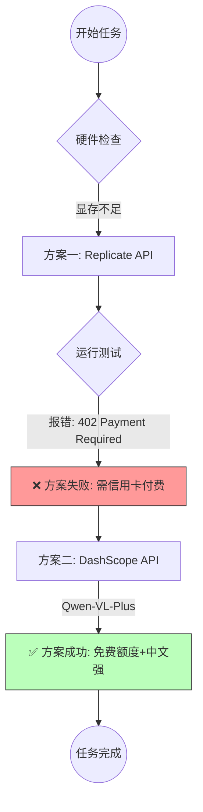
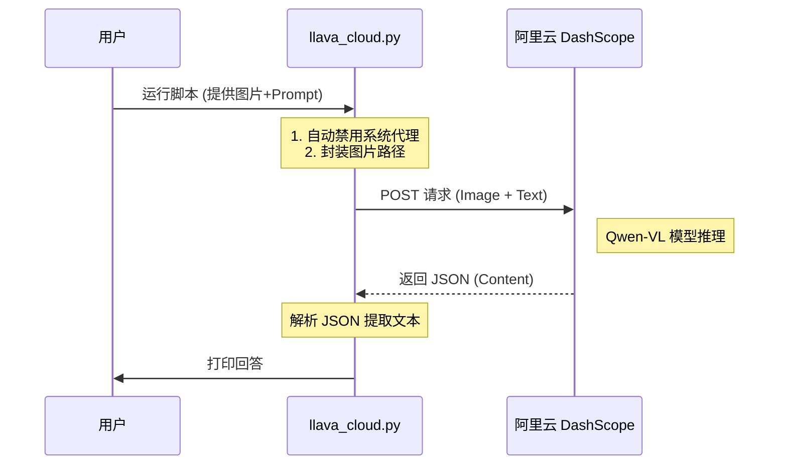

<div style="display: flex; align-items: flex-start;">

<!-- 左侧目录 -->
<div style="width: 200px; position: sticky; top: 0; height: 100vh; overflow-y: auto; background-color: #f6f8fa; padding: 20px; border-right: 1px solid #d0d7de; flex-shrink: 0;">

<h3 style="margin-top: 0;">📚 目录导航</h3>

1. [核心任务](#1-核心任务)
2. [技术术语表](#2-技术术语表)
3. [文件清单与作用](#3-文件清单与作用)
4. [流程可视化](#4-流程可视化)
5. [详细操作步骤](#5-详细操作步骤)
   - [环境准备](#51-环境准备)
   - [代码实现](#52-代码实现)
   - [运行验证](#53-运行验证)
6. [遇到的坑与解决](#6-遇到的坑与解决)
7. [结果分析](#7-结果分析)

</div>

<!-- 右侧正文 -->
<div style="flex-grow: 1; padding: 20px; min-width: 0;">

# 第30周学习笔记：云端多模态实战 (LLaVA/Qwen-VL)

## 1. 核心任务

本周主要攻克了 **多模态大模型 (Multimodal LLM)** 的图文问答任务。
由于本地电脑（核显）无法运行庞大的 LLaVA 模型，我们采取了 **“云端 API 调用”** 的策略。从最初尝试国外的 Replicate 平台（因收费受阻），最终成功切换到国内的 **DashScope (阿里云灵积)** 平台，使用 **Qwen-VL-Plus** 模型实现了高质量的图片理解与问答。

## 2. 技术术语表

| 英文 Term | 中文 | 极简解释 |
| :--- | :--- | :--- |
| **Multimodal** | 多模态 | **全能选手**。以前的模型只能看文字，多模态模型能看图、看视频、听声音。 |
| **LLaVA** | / | **开源先锋**。Large Language-and-Vision Assistant，目前最流行的开源图文大模型架构。 |
| **Qwen-VL** | 通义千问-视觉 | **国产之光**。阿里巴巴开发的视觉语言模型，中文理解能力和识图能力极强。 |
| **DashScope** | 灵积平台 | **模型超市**。阿里云提供的 API 服务平台，也就是我们调用 Qwen-VL 的“云端服务器”。 |
| **Prompt Engineering** | 提示词工程 | **提问的艺术**。怎么问模型，才能让它按你的要求回答，而不是胡言乱语。 |
| **Zero-shot** | 零样本 | **直接上手**。不给模型看例子，直接丢给它一张新图和问题，看它能不能答对。 |

## 3. 文件清单与作用

所有文件均已归档至 `第30周` 文件夹下。

| 文件名 | 类型 | 作用 |
| :--- | :--- | :--- |
| `llava_cloud.py` | **核心脚本** | 实现了对 DashScope API 的调用。包含图片编码、代理屏蔽、错误处理和结果解析。 |
| `操作.md` | **说明文档** | 记录了从环境安装到运行代码的完整步骤。 |
| `example.png` | **测试素材** | 一张中国传统建筑风格的插画，用于测试模型的识别能力。 |

## 4. 流程可视化

我们经历了一次方案的迭代（Pivot）：



**代码执行流程：**



## 5. 详细操作步骤

### 5.1 环境准备
我们需要安装阿里云的官方 SDK 和图像处理库。
```bash
pip install dashscope pillow
```

### 5.2 代码实现 (`llava_cloud.py`)
核心在于如何处理网络环境和构建正确的消息格式。

**关键代码片段：**
```python
# 1. 禁用代理（防止国内 API 访问失败）
import os
os.environ.pop('http_proxy', None)
os.environ.pop('https_proxy', None)

# 2. 构建多模态消息
messages=[{
    'role': 'user',
    'content': [
        {'image': f'file://{os.path.abspath(image_path)}'}, # 本地图片绝对路径
        {'text': prompt}
    ]
}]
```

### 5.3 运行验证
通过命令行直接运行，查看模型对 `example.png` 的解读。
```powershell
python "f:\Desktop\个人资料\大模型学习项目\第30周\llava_cloud.py"
```

## 6. 遇到的坑与解决

### 坑1：Replicate 并非完全免费
*   **现象**：运行 LLaVA 示例时报错 `402 Payment Required`。
*   **原因**：Replicate 虽然有试用，但额度极低或需要绑定支付方式。
*   **解决**：**果断切换**。改用阿里云 DashScope，新用户有大量免费 Token，且 Qwen-VL 中文效果更好。

### 坑2：模型“自作聪明” (Prompt 遵循问题)
*   **现象**：Prompt 写的是 `“请用中文详细描述图片，并回答我提出的复杂问题”`，但并未写明什么复杂问题。模型于是自己编了一个问题（如“图里的主题是什么？”）并回答。
*   **原因**：**指令模糊**。LLM 倾向于补全逻辑，当上下文缺失时，它会通过“幻觉”或“自问自答”来填补空白。
*   **解决**：**明确指令**。将 Prompt 修改为具体的 `“这张图里的建筑风格属于哪个朝代或类型？”`，模型立刻给出了精准的分析（唐宋风格/楼阁式塔）。

### 坑3：代理导致的连接错误
*   **现象**：开启科学上网工具时，访问国内阿里云 API 报错 `Connection Error` 或 `ProxyError`。
*   **原因**：Python `requests` 库会自动读取系统代理设置，导致流量绕路。
*   **解决**：在代码最开头强制移除环境变量：
    ```python
    os.environ.pop('http_proxy', None)
    os.environ.pop('https_proxy', None)
    ```

## 7. 结果分析

*   **识别能力**：Qwen-VL-Plus 能够极其精准地识别图片细节（如“五层塔楼”、“翘起的飞檐”、“深色瓦片”）。
*   **知识推理**：不仅是看图，还能结合外部知识库，推断出建筑风格属于“唐代或宋代”，并解释理由。
*   **应用场景**：这种能力可以用于 **智能导游、视障辅助、自动化图文审核** 等场景。

</div>
</div>
