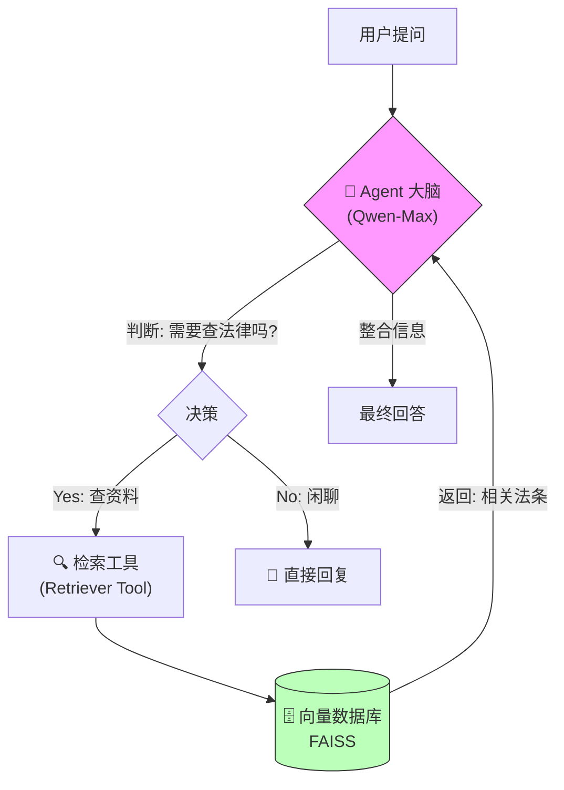

<div style="display: flex; align-items: flex-start;">

<!-- 左侧目录 -->
<div style="width: 200px; position: sticky; top: 0; height: 100vh; overflow-y: auto; background-color: #f6f8fa; padding: 20px; border-right: 1px solid #d0d7de; flex-shrink: 0;">

<h3 style="margin-top: 0;">📚 目录导航</h3>

1. [核心任务](#1-核心任务)
2. [技术术语表](#2-技术术语表)
3. [系统架构图](#3-系统架构图)
4. [关键技术点](#4-关键技术点)
5. [代码深度解析](#5-代码深度解析)
   - [RAG 知识库](#51-rag-知识库)
   - [Agent 智能体](#52-agent-智能体)
6. [遇到的坑与优化](#6-遇到的坑与优化)
7. [结果分析](#7-结果分析)

</div>

<!-- 右侧正文 -->
<div style="flex-grow: 1; padding: 20px; min-width: 0;">

# 第31-32周学习笔记：RAG + Agent 智能客服

## 1. 核心任务

本周我们从单一的“大模型问答”进化到了 **“智能体系统”**。
我们构建了一个智能客服，它不仅能陪聊，还能**主动查阅**我们提供的《民法典》片段，回答专业的法律问题。

**达成路径：**
1.  **RAG (检索增强)**：给模型外挂一个“法律知识库”（TXT文件）。
2.  **Agent (智能体)**：给模型装上“手”，让它能自主决定是“查资料”还是“直接回”。
3.  **Memory (记忆)**：给模型装上“海马体”，让它记得我们刚才聊了什么。

## 2. 技术术语表

| 英文 Term | 中文 | 极简解释 |
| :--- | :--- | :--- |
| **RAG** | 检索增强生成 | **开卷考试**。模型遇到不会的题，先去翻书（检索），找到答案后再抄下来（生成）。 |
| **Agent** | 智能体 | **独立思考者**。它不再是“你说一句我回一句”，而是会思考“为了回答这个问题，我需要先使用搜索工具吗？” |
| **Vector Database** | 向量数据库 | **语义仓库**。把文字变成数字（向量）存起来，方便计算机按“意思”搜索，而不是按“关键词”搜索。 |
| **Embedding** | 嵌入 | **翻译官**。把“合同”这两个字翻译成一串数字 `[0.1, 0.5, ...]`，让计算机能理解它的语义。 |
| **FAISS** | / | **搜索神器**。Facebook 开源的向量检索库，速度极快。 |
| **Chain** | 链 | **流水线**。把检索、思考、回答这一系列动作串联起来的工具。 |

## 3. 系统架构图



**原理拆解（第一性原理）：**
1.  **TXT 文件 (`law_sample.txt`)**：好比是一本**书**。
2.  **向量数据库 (`vectorstore`)**：好比是把书里的内容打碎、整理好放进了一个**图书馆的索引柜**。
3.  **检索器 (`retriever`)**：好比是一个**图书管理员**，你问他问题，他能快速从索引柜里找到相关的章节。
4.  **工具 (`tool`)**：好比是我们给 Agent（智能客服）配的一个**电话热线**。
    *   我们在代码里定义了这个工具：`search_legal_docs`。
    *   我们告诉 Agent：“如果你遇到不懂的法律问题，就拨打这个热线（使用这个工具）。”
    *   一旦 Agent 拨通热线，电话那头的“图书管理员”（Retriever）就会去查“索引柜”（VectorStore），最终追溯到那本“书”（TXT 文件）。

## 4. 关键技术点

### 4.1 为什么用 DashScope Embeddings？
在之前的计划中，通常使用 `HuggingFaceEmbeddings` (如 `all-MiniLM-L6-v2`)。但本周我们做了优化，改用阿里自家的 `DashScopeEmbeddings`。
*   **原因 1**：原模型是英文的，对中文法律文档理解很差。
*   **原因 2**：本地加载 HuggingFace 模型需要下载几百 MB 甚至 GB 的文件，且占用内存。
*   **优势**：云端 API 调用，**零本地存储**，速度快，且原生支持中文语义。

### 4.2 记忆机制 (Memory)
我们使用了 `ConversationBufferMemory`。
*   **没有记忆**：
    *   用户：“合同违约赔什么？” -> AI：“赔偿损失。”
    *   用户：“那违约金太高呢？” -> AI：“什么太高？我不懂你在说什么。”
*   **有记忆**：
    *   AI 会把上一轮的“合同违约”作为上下文，理解你问的“违约金”是基于“合同”的。

## 5. 代码深度解析

### 5.1 RAG 知识库
我们将文本转化为向量，存入 FAISS。
```python
# 把“民法典”切成小块，每块500字
text_splitter = RecursiveCharacterTextSplitter(chunk_size=500)
# 用阿里通义的嵌入模型变成向量，存入 FAISS
embeddings = DashScopeEmbeddings(model="text-embedding-v1")
vectorstore = FAISS.from_documents(texts, embeddings)
```

### 5.2 Agent 智能体
这是最精彩的部分，我们告诉 AI：“你有一个工具叫 `search_legal_docs`”。
```python
# 1. 定义工具
tool = create_retriever_tool(
    retriever,
    "search_legal_docs", # 工具名称
    "用于搜索法律法规...当用户询问法律问题时，必须使用此工具..." # 工具说明书 (Prompt)
)

# 2. ReAct 模式
# AI 会按照：Thought(思考) -> Action(行动) -> Observation(观察) 的步骤循环。
agent = create_react_agent(llm, tools, prompt)
```

## 6. 遇到的坑与优化

1.  **代理问题**：LangChain 默认不处理系统代理，导致国内 API 连接超时。
    *   **解决**：在代码头部强制 `os.environ.pop('http_proxy')`。
2.  **模型幻觉**：如果文档里没答案，模型可能会瞎编。
    *   **解决**：在 Prompt 中严格约束，“必须使用工具查找信息”，并在检索结果为空时如实告知。
3.  **Token 限制**：法律文档如果太长，一次塞不进 Prompt。
    *   **解决**：使用 `RecursiveCharacterTextSplitter` 切分文档，只检索最相关的片段（Top-K）给大模型。

## 7. 结果分析

运行脚本后，你会看到 AI 像一个真正的人类专家一样：
1.  先**自言自语**：“用户问了违约，我得查查法条。”
2.  然后**去查书**（调用工具）。
3.  最后**总结陈词**，给出准确的法律建议。

这就是 **Agent** 的魅力：它不再是简单的鹦鹉学舌，而是开始具备了**使用工具解决问题**的能力。

</div>
</div>
