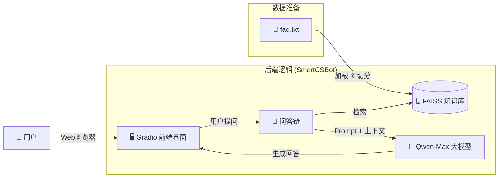

<!-- 左侧目录 -->

<h3 style="margin-top: 0;">📚 目录导航</h3>

1. [核心任务](#1-核心任务)
2. [技术架构图](#2-技术架构图)
3. [核心组件解析](#3-核心组件解析)
   - [Gradio 界面](#31-gradio-界面)
   - [RAG 引擎](#32-rag-引擎)
   - [Prompt 优化](#33-prompt-优化)
4. [国产化优势](#4-国产化优势)
5. [下一步计划](#5-下一步计划)

<!-- 右侧正文 -->

# 第33-36周学习笔记：企业级智能客服 (Gradio + RAG)

## 1. 核心任务

本阶段的目标是**产品化**。
之前的代码只能在黑乎乎的终端里跑，现在我们做出了一个**网页版**的智能客服系统。它不仅长得好看，而且“脑子”里装满了企业的私有知识（如退换货政策），可以直接部署给真实用户使用。

## 2. 技术架构图

## 3. 核心组件解析

### 3.1 Gradio 界面 (`app.py`)
我们使用了 `Gradio`，这是目前 AI 领域最流行的快速演示框架。
*   **ChatInterface**：一行代码生成类似 ChatGPT 的聊天窗口，自带历史记录管理、重试、撤回功能。
*   **Blocks**：允许我们灵活布局，比如在右侧添加“管理员操作面板”，实现知识库的热重载。

### 3.2 RAG 引擎 (`rag_engine.py`)
我们将之前的零散代码封装成了 `SmartCSBot` 类，符合**面向对象编程 (OOP)** 的思想。
*   **解耦**：界面代码 (`app.py`) 和 逻辑代码 (`rag_engine.py`) 分离。以后如果想换个界面（比如换成微信小程序），逻辑代码完全不用改。
*   **单例模式**：在内存中只加载一次模型和知识库，避免每次对话都重新加载，极大地提升了响应速度。

### 3.3 Prompt 优化
我们给 AI 设定了**人设**（Persona）：
> “你是一个专业的电商智能客服‘小蜜’...如果不知道答案，请礼貌地回答...”

这能有效防止 AI **“一本正经地胡说八道”**（幻觉），确保它只回答知识库里有的内容。

## 4. 国产化优势

本次重构完全抛弃了国外的 OpenAI 和 Hugging Face 托管，全面拥抱国产生态：
1.  **模型**：阿里云 Qwen-Max（通义千问），中文理解能力 Top 级。
2.  **嵌入**：DashScope Embeddings，不需要本地下载模型文件，轻量高效。
3.  **网络**：所有 API 均直连国内服务器，**无需科学上网**，延迟极低。

## 5. 下一步计划

目前的系统已经具备了“大脑”和“嘴巴”，接下来的几周我们可以考虑：
1.  **语音交互**：接入 FunASR，让它能听懂语音，并能开口说话。
2.  **多知识库切换**：支持上传 PDF/Word 文档，动态更新知识库。
3.  **真实部署**：真正将它部署到公网服务器上，让朋友们也能访问。

