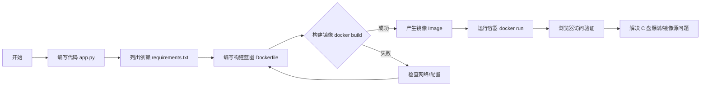

# 第37周学习笔记：Docker 容器化入门

## 目录
- [1. 任务路径复盘](#1-任务路径复盘)
- [2. 核心概念：什么是 Docker？](#2-核心概念什么是-docker)
- [3. 关键技术详解](#3-关键技术详解)
- [4. 重点词汇表 (Glossary)](#4-重点词汇表-glossary)
- [5. 下周预告](#5-下周预告)

## 1. 任务路径复盘

本周我们的目标是从“本地直接运行 Python”进化到“使用容器封装应用”，这是走向工程化部署的第一步。
特别是解决了 **Windows 11 下的 Docker 安装、WSL2 资源限制、国内镜像源加速** 等关键环境问题。



## 2. 核心概念：什么是 Docker？

想象你要搬家。
- **以前 (虚拟机/物理机)**：你需要把家具、电器、甚至墙纸和地板都拆下来，运到新家再一点点组装。非常麻烦，而且新家的插座可能不匹配。
- **现在 (Docker)**：你把整个房间（包括家具、环境配置）直接打包成一个**集装箱 (Container)**。无论运到哪里（Windows、Linux、云服务器），只要打开集装箱，里面就是你熟悉的房间，完全一模一样。

### 三大支柱

| 概念 | 英文 | 解释 | 比喻 |
| :--- | :--- | :--- | :--- |
| **镜像** | **Image** | 程序的“安装包”。它是只读的，包含了运行程序所需的一切（代码、Python环境、系统库）。 | 像是一个“印章”或者“模具”。 |
| **容器** | **Container** | 镜像的“运行实例”。通过镜像启动的进程，它是可读写的。 | 像是用印章盖出来的“图案”，或者是从模具里倒出来的“蛋糕”。你可以吃掉蛋糕（停止容器），但模具（镜像）还在。 |
| **仓库** | **Registry** | 存放镜像的地方。 | 像是手机上的“应用商店”或“GitHub”。 |

## 3. 关键技术详解

### 3.1 Dockerfile 解读

我们在 `Dockerfile` 中写的每一行指令，都是在告诉 Docker 如何制作这个“模具”。

```dockerfile
# 1. 基础镜像：选择一个自带 Python 3.10 的轻量级 Linux 系统 (Slim 版本)
FROM python:3.10-slim

# 2. 工作目录：在容器内部创建一个叫 /app 的文件夹，并进入其中
WORKDIR /app

# 3. 设置时区：防止时间差问题 (国内必备)
ENV TZ=Asia/Shanghai
RUN ln -snf /usr/share/zoneinfo/$TZ /etc/localtime && echo $TZ > /etc/timezone

# 4. 复制文件：把电脑当前目录下的所有文件，拷贝到容器的 /app 目录
COPY . .

# 5. 安装依赖：关键点！使用清华源加速下载，否则在国内会慢到报错
# --no-cache-dir 表示不保存缓存文件，减小镜像体积
RUN pip install --no-cache-dir -r requirements.txt -i https://pypi.tuna.tsinghua.edu.cn/simple

# 6. 暴露端口：告诉 Docker 这个应用会使用 8000 端口
EXPOSE 8000

# 7. 启动命令：容器启动时自动执行的命令
CMD ["uvicorn", "app:app", "--host", "0.0.0.0", "--port", "8000"]
```

### 3.2 端口映射 (Port Mapping)

在使用 `docker run -p 8000:8000` 时：
- 第一个 `8000` 是 **宿主机端口**（你的 Windows 电脑）。
- 第二个 `8000` 是 **容器端口**（容器内部）。
- 就像是在集装箱上开了一个“窗口”，把你电脑的 8000 端口连通到集装箱里的 8000 端口，这样你才能在浏览器访问。

### 3.3 常用命令速查表 (Cheat Sheet)

| 场景 | 命令 | 说明 |
| :--- | :--- | :--- |
| **构建** | `docker build -t <名字> .` | 注意最后有个点，代表当前目录 |
| **运行** | `docker run -d -p 8000:8000 <名字>` | `-d` 后台运行，`-p` 端口映射 |
| **查看** | `docker ps` | 查看正在运行的容器 |
| **停止** | `docker stop <ID>` | 停止容器，ID 只需要输前几位 |
| **删除** | `docker rm <ID>` | 删除容器 (必须先停止) |
| **清理** | `docker system prune` | 清理未使用的镜像和缓存 (释放磁盘) |

## 4. 实战踩坑与优化记录

### 4.1 镜像下载慢/失败
- **现象**：`docker build` 卡在下载层，或报错 `fetch http...`。
- **原因**：Docker Hub 官方源在国外，国内访问受限。
- **解决**：配置阿里云/DaoCloud 加速源。
  - 修改 `~/.docker/daemon.json`。
  - **注意**：JSON 文件不能包含 BOM 签名，否则 Docker 无法启动。需用 UTF-8 (无BOM) 保存。

### 4.2 C 盘爆满危机
- **现象**：Docker 默认将数据存放在 `%LOCALAPPDATA%\Docker`，`docker_data.vhdx` 动辄几十 GB。
- **解决**：
  1. Docker Desktop 设置 -> Resources -> Disk image location -> 更改到 F 盘。
  2. 使用 PowerShell 脚本将 `.cache` (HuggingFace 模型) 和 `miniconda3` 移动到 F 盘并创建软链接。

### 4.3 环境变量未生效
- **现象**：安装 Docker 后运行 `docker --version` 报错找不到命令。
- **解决**：重启 PowerShell，或手动添加环境变量 `$env:Path += ";C:\Program Files\Docker\Docker\resources\bin"`。

## 5. 重点词汇表 (Glossary)

为了方便后续查阅文档，这里列出常见的英文术语。

- **Build (构建)**: 根据 Dockerfile 创建镜像的过程。
- **Run (运行)**: 启动一个容器。
- **Daemon (守护进程)**: Docker 的后台服务，负责管理镜像和容器。
- **Volume (挂载卷)**: 用于持久化数据。容器删除后数据会丢失，但挂载卷可以将数据保存在你的电脑上。（下周会用到）
- **Environment Variable (环境变量)**: 传递给程序的配置信息，比如 API Key。Docker 中常用 `-e` 参数设置。

## 5. 下周预告

恭喜你掌握了 Docker 基础！
下周我们将进入**第38周**，使用国产开源的 **Bisheng (毕昇)** 平台。
我们将使用 Docker Compose（一次启动多个容器）来部署这个强大的 LLM 应用开发平台，它不需要写代码就能通过拖拉拽构建复杂的 AI 应用，完美适配你的需求。
