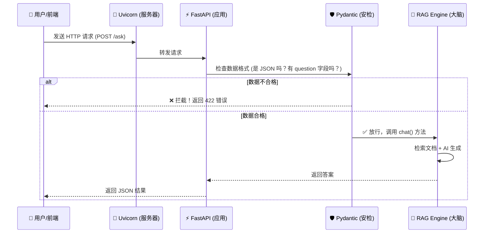

# 第38周学习笔记：FastAPI 封装与工程化

[TOC]

本周任务：将“单机版”Python 脚本升级为“网络版”API 服务。

---

## 🗺️ 全局架构图

这是我们本周构建的系统架构，一眼看懂请求是如何流动的：



---

## 🎯 核心路径 (20/80 原则)

掌握这 4 个概念，就能解决 80% 的 API 开发需求：

| 组件/概念 | 英文全称 | 角色比喻 | 功能说明 |
| :--- | :--- | :--- | :--- |
| **FastAPI** | Fast API | **大堂经理** | 负责接待客人，分配任务，速度极快。 |
| **Uvicorn** | Uvicorn | **传菜员** | 负责在网络和 Python 代码之间快速传递数据。 |
| **Pydantic** | Python Data Validation | **保安** | 严格检查进来的数据，不合规直接拒之门外。 |
| **Endpoint** | API Endpoint | **服务窗口** | 具体的办事窗口，如 `/ask` (问答窗口), `/login` (登录窗口)。 |

---

## 📂 项目结构可视化

工程化不仅仅是写代码，更是组织文件。本周后的目录结构如下：

```text
第38周/
├── 📄 app.py              # 🚪 [入口] API 服务定义，大堂经理在这里
├── 📄 rag_engine.py       # 🧠 [核心] RAG 业务逻辑，大脑在这里
├── 📄 requirements.txt    # 📦 [清单] 依赖包列表
├── 📂 data/               # 📚 [仓库] 存放知识库 txt 文件
└── 📄 操作.md             # 📖 [说明书]
```

---

## 📚 关键代码拆解

### 1. 定义数据模型 (Pydantic)
这就好比设计一张“表格”，用户填的内容必须符合格式。

```python
from pydantic import BaseModel

class Query(BaseModel):
    # 规定：必须叫 question，且必须是字符串
    question: str 
```

### 2. 创建接口 (Endpoint)
这就是开了一个“窗口”来办理业务。

```python
# @app.post: 表示这是一个 POST 窗口（适合提交数据）
# "/ask": 窗口号码
@app.post("/ask") 
def ask(query: Query): # 这里的 query 已经被 Pydantic 检查过了，放心用
    return {"answer": qa_bot.chat(query.question)}
```

---

## 💡 常见 HTTP 方法对比

| 方法 | 英文 | 场景 | 比喻 |
| :--- | :--- | :--- | :--- |
| **GET** | GET | 获取数据 | **去图书馆借书**（只需要告诉图书管理员书名） |
| **POST** | POST | 提交数据 | **去银行填表汇款**（需要把钱和表单都给柜员，内容藏在信封里） |

---

## 🧐 常用命令速查

| 动作 | 命令 | 说明 |
| :--- | :--- | :--- |
| **启动服务** | `uvicorn app:app --reload` | `--reload` 表示代码改了自动重启，开发必备。 |
| **查看端口** | `netstat -ano \| findstr :8000` | 查看到底是谁占用了 8000 端口。 |
| **杀掉进程** | `taskkill /F /PID <进程ID>` | 强制关闭占用端口的程序。 |
| **停止服务** | `Ctrl + C` | 在终端窗口按下组合键，优雅地停止 Uvicorn 服务。 |

---

## 🧐 第一性原理：为什么要封装？

你可能会问：*“我直接运行 python 脚本也能跑，为什么要费劲封装成 API？”*

**代码的本质是为了被使用。**

- **封装前 (脚本)**：就像**私家车**，只有拿着钥匙（源码）的你（开发者）能开，还得在特定的路况（环境）下跑。
- **封装后 (API)**：就像**公交车**，任何人（前端、APP、其他系统）只要在站台（接口地址）等车，投币（发送请求）就能坐，不用管车怎么开，也不用管发动机原理。

**结论**：FastAPI 封装是**将“个人实验品”转化为“互联网产品”的关键一步**。没有这一步，AI 再强也只是你电脑里的一个“玩具”，无法服务大众。
