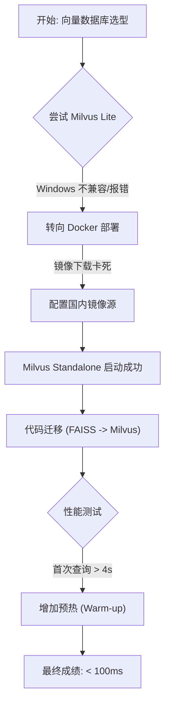

# 第39周学习笔记：向量数据库进阶 (Milvus)

## 目录
- [1. 任务路径复盘](#1-任务路径复盘)
- [2. 核心概念：为什么需要专业向量数据库？](#2-核心概念为什么需要专业向量数据库)
- [3. 实战踩坑与解决方案 (关键经验)](#3-实战踩坑与解决方案-关键经验)
- [4. 关键技术详解](#4-关键技术详解)
- [5. 重点词汇表 (Glossary)](#5-重点词汇表-glossary)
- [6. 下周预告](#6-下周预告)

## 1. 任务路径复盘

本周目标是从“本地小作坊”升级到“企业级大工厂”。我们经历了从失败到成功的迭代过程。

### 1.1 本周关键文件清单
以下是第39周的核心产出，每一个文件都是一个里程碑：

| 文件名 | 类型 | 作用 |
| :--- | :--- | :--- |
| **[docker-compose.yml](docker-compose.yml)** | 配置文件 | **基石**。定义了 Milvus Standalone 的三个微服务 (Milvus, Etcd, MinIO) 如何配合运行。 |
| **[100.py](100.py)** | Python 脚本 | **验收工具**。用于生成 100万条向量数据，并测试“检索 < 100ms”的核心指标。 |
| **[rag_milvus.py](rag_milvus.py)** | Python 脚本 | **成果**。将原来的 RAG 引擎改造为 Milvus 后端，实现了从 FAISS 的无缝迁移。 |
| **[操作.md](操作.md)** | 文档 | **说明书**。记录了如何启动 Docker、如何运行测试脚本的具体步骤。 |
| **[requirements.txt](requirements.txt)** | 依赖表 | **环境**。记录了本周新增的依赖库，主要是 `pymilvus`。 |

## 2. 核心概念：为什么需要专业向量数据库？

想象你在管理图书馆。
- **FAISS (本地文件)**：像是一个 **Excel 表格**。书少的时候（几千本），Ctrl+F 查找很快。但如果书有几百万本，打开表格都要很久，查找更是卡死。而且一旦电脑断电，没保存的记录就丢了。
- **Milvus (数据库)**：像是一套 **专业的图书管理系统**。
  - **C/S 架构**：数据库运行在服务器（Docker）上，你的代码只是客户端。
  - **持久化**：数据存硬盘，断电不丢失。
  - **高性能**：专门为“向量计算”优化，几亿条数据也能毫秒级返回。

### 对比表

| 特性 | FAISS (Local) | Milvus (Standalone) |
| :--- | :--- | :--- |
| **部署难度** | 简单 (pip install) | 中等 (Docker Compose) |
| **数据规模** | < 100万 (受内存限制) | 亿级 (支持硬盘/内存交换) |
| **数据安全** | 容易丢失 (文件损坏) | 高可靠 (Etcd/MinIO保障) |
| **适用场景** | 个人学习、Demo | 生产环境、企业级应用 |

## 3. 实战踩坑与解决方案 (关键经验)

这是本周最有价值的部分，**“坑”就是成长的阶梯**。

### 3.1 ❌ 坑一：Windows 兼容性地狱
*   **现象**：`pip install milvus-lite` 报错，无法找到匹配版本。
*   **原因**：Milvus Lite 对 Windows 支持不佳。
*   **解法**：**Docker 是 Windows 开发者的救星**。使用 WSL2 + Docker Desktop 部署标准版 Milvus。

### 3.2 ❌ 坑二：Docker 镜像下载慢
*   **现象**：`docker-compose up` 卡在 Pulling 阶段，速度几 KB/s。
*   **原因**：Docker Hub 国内访问受限。
*   **解法**：配置 `daemon.json`，添加国内镜像源（如 DaoCloud、南京大学镜像）。

### 3.3 ❌ 坑三：索引冲突 (Index Conflict)
*   **现象**：报错 `at most one distinct index is allowed per field`。
*   **原因**：Milvus 2.4+ 在创建集合时如果指定了 `metric_type`，会自动创建一个默认索引。再手动创建 HNSW 索引就会冲突。
*   **解法**：在创建索引前加 `try-except`，或者先检查索引是否存在。

### 3.4 ❌ 坑四：冷启动性能欺骗
*   **现象**：第一次查询耗时 4秒+，远超 100ms 目标。
*   **原因**：**冷启动 (Cold Start)**。数据库需要先将索引文件从磁盘加载到内存。
*   **解法**：**预热 (Warm-up)**。在正式计时前，先跑几次空查询，让数据“热”起来。

## 4. 关键技术详解

### 4.1 HNSW 索引 (Hierarchical Navigable Small World)
这是 Milvus 快如闪电的秘密武器。它不把所有向量排成一排挨个找（暴力搜索），而是建立了一个**多层导航图**。

*   **比喻**：你想从北京找某个偏僻的小村庄。
    *   **暴力搜索**：拿着地图，把中国所有村庄名字看一遍。
    *   **HNSW**：
        1.  先看“高速公路层”，快速定位到“浙江省”。
        2.  进入“省道层”，定位到“杭州市”。
        3.  进入“乡道层”，直接找到那个村庄。

### 4.2 Docker Compose 微服务架构
你在 `docker-compose.yml` 中看到了三个服务，它们各司其职：
1.  **Milvus Standalone**: **大脑**。负责处理请求、计算向量相似度。
2.  **Etcd**: **记事本**。记录元数据（比如“有哪些集合”、“集合里有哪些字段”）。
3.  **MinIO**: **仓库**。负责真正存储数据文件（向量数据、日志）。

## 5. 重点词汇表 (Glossary)

| 英文 | 中文 | 解释 |
| :--- | :--- | :--- |
| **Collection** | 集合 | 类似 SQL 里的“表 (Table)”。存放同一类数据。 |
| **Field** | 字段 | 类似表里的“列”。如 `id`, `vector`。 |
| **Dimension** | 维度 | 向量长度。必须与 Embedding 模型一致 (如 768)。 |
| **Metric Type** | 度量类型 | 相似度算法。`L2` (欧氏距离) 或 `IP` (内积)。 |
| **Index** | 索引 | 加速查询的数据结构。Milvus 中首选 `HNSW`。 |
| **Warm-up** | 预热 | 系统启动后先做少量任务，使其达到最佳状态的操作。 |

## 6. 下周预告

恭喜你攻克了 RAG 系统中最硬核的“存储层”！
下周我们将进入**第40周**，整合之前的所有成果：
我们将使用 **Dify** 或 **Bisheng** 这种可视化的 LLM 应用编排平台，把你的 RAG 引擎封装成一个漂亮的 Web 应用，真正做成一个可以交付的产品。
