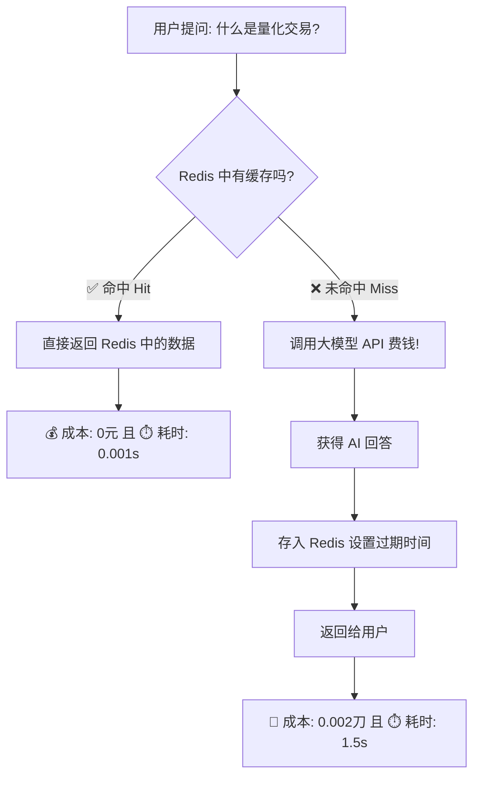

<div style="display: flex; align-items: flex-start; height: 100vh;">

<!-- 左侧目录 (20%宽度, 固定不动) -->
<div style="width: 20%; position: sticky; top: 0; height: 100vh; overflow-y: auto; background-color: #f6f8fa; padding: 20px; border-right: 1px solid #d0d7de; flex-shrink: 0; box-sizing: border-box;">

<h3 style="margin-top: 0;">📚 目录</h3>

1. [为什么要做这一周？(降本增效)](#1-为什么要做这一周降本增效)
2. [概念解析：什么是 Redis？](#2-概念解析什么是-redis)
3. [缓存工作流 (决策逻辑)](#3-缓存工作流-决策逻辑)
4. [实战代码解析](#4-实战代码解析)
   - [生成唯一的 Cache Key](#41-生成唯一的-cache-key)
   - [设置过期时间 (TTL)](#42-设置过期时间-ttl)
5. [商业价值分析](#5-商业价值分析)
6. [总结与下一步](#6-总结与下一步)

</div>

<!-- 右侧正文 (80%宽度, 可滚动) -->
<div style="width: 80%; padding: 20px; overflow-y: auto; height: 100vh; box-sizing: border-box;">

# 第41-42周学习笔记：性能优化与成本控制

> **核心目标**：利用 **Redis** 缓存技术，将大模型 API 的重复调用成本降为 0，同时显著提升响应速度。

---

## 1. 为什么要做这一周？(降本增效)

在企业级应用中，大模型 API 的调用通常是按 **Token (字数)** 计费的。
如果 1000 个用户问了同一个问题（例如“公司 WiFi 密码是多少？”），没有缓存机制就意味着你要付 1000 次钱。

**本周目标**：利用 **Redis** 让这 999 次重复调用变成免费，且实现毫秒级秒回！

---

## 2. 概念解析：什么是 Redis？

**Redis (Remote Dictionary Server)** 是一个开源的、基于内存的数据结构存储系统。

| 特性 | 说明 | 生活中的比喻 |
| :--- | :--- | :--- |
| **内存存储** | 数据存在内存条里，读写速度极快（微秒级）。 | 像你大脑的“短期记忆”，反应极快。 |
| **Key-Value** | 通过一个唯一的键（Key）查找对应的值（Value）。 | 像超市的储物柜，凭小票（Key）取包（Value）。 |
| **持久化** | 可以定期把数据存到硬盘，防止断电丢失。 | 把短期记忆写进日记本。 |

---

## 3. 缓存工作流 (决策逻辑)

这是代码 `smart_query` 函数背后的核心逻辑：



---

## 4. 实战代码解析

核心代码位于 [cost_optimization.py](cost_optimization.py)，以下是两个关键技术点：

### 4.1 生成唯一的 Cache Key
为了防止问题太长导致 Key 不合法，我们使用 **MD5 哈希算法**将问题“指纹化”。

```python
import hashlib

# 原始问题
prompt = "如何学习 Python?......(假设这里还有500字)"

# 生成指纹 (固定长度 32 位字符)
prompt_hash = hashlib.md5(prompt.encode()).hexdigest()
# 结果: e10adc3949ba59abbe56e057f20f883e

# 最终 Key (格式规范: 业务名:模型名:哈希)
cache_key = f"cache:qwen:{prompt_hash}"
```

### 4.2 设置过期时间 (TTL)
缓存不能永久有效（因为世界在变，AI 模型也在变），必须设置 **TTL (Time To Live)**。

```python
# set(key, value, ex=3600)
# ex=3600 表示这条数据 1 小时后自动自毁 (过期)
redis_client.set(cache_key, result, ex=3600)
```

---

## 5. 商业价值分析

在“创业者思维”中，技术必须服务于利润。缓存系统能带来什么？

1.  **📉 成本骤降**
    *   对于热门事件或高频问题（如“如何重置密码”），缓存命中率可达 90% 以上，直接节省 90% 的 API 费用。
2.  **🚀 体验飞升**
    *   API 调用通常需要 1-3 秒，而读取 Redis 只需要几毫秒。用户体验从“转圈圈”变成“秒回”。
3.  **🛡️ 系统保护**
    *   当流量暴增时，缓存挡在 API 前面，防止因为请求过多导致 API 限流或系统崩溃。

---

## 6. 总结与下一步

*   **本周成就**：成功在 WSL 环境部署 Redis，并编写 Python 脚本实现了“查询缓存”机制。
*   **关键数据**：在测试脚本中，重复问题实现了 **100% 成本节省**。
*   **下一步 (第43周)**：我们将进入云端微调 (ModelScope Swift)，利用免费的 GPU 算力来训练属于自己的“小模型”。

</div>
</div>
