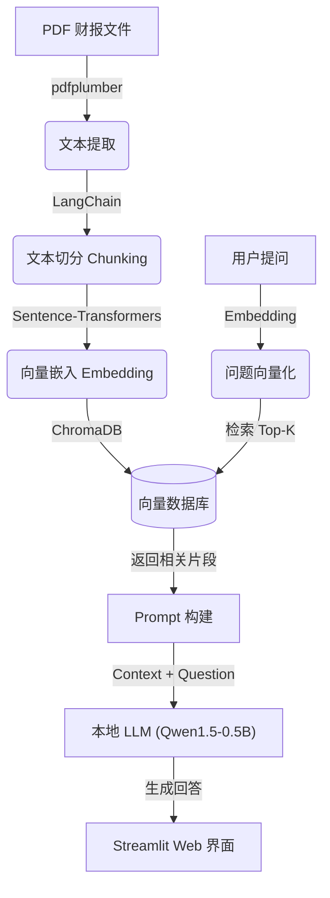

# 金融投研助手技术白皮书

## 1. 项目概述
本项目旨在构建一个基于**本地化大模型 (Local LLM)** 与 **检索增强生成 (RAG)** 技术的金融投研助手。系统能够自动解析金融财报（PDF），构建私有知识库，并提供基于事实的智能问答服务，解决传统金融分析中信息过载与隐私泄露的痛点。

## 2. 核心价值
*   **数据隐私保障**：全流程本地运行，敏感金融数据不上传云端。
*   **精准事实溯源**：基于 RAG 技术，回答直接引用财报原文，减少模型幻觉。
*   **高效信息提取**：自动化处理长文档，快速提炼营收、风险等关键指标。

## 3. 系统架构
系统采用经典的 RAG 架构，包含数据处理层、检索层、生成层与应用层。

## 4. 关键技术栈
| 模块 | 技术选型 | 说明 |
| :--- | :--- | :--- |
| **前端界面** | Streamlit | 快速构建交互式 Web UI，支持聊天历史记录 |
| **PDF 解析** | pdfplumber | 高精度提取 PDF 文本与表格数据 |
| **文本处理** | LangChain | `RecursiveCharacterTextSplitter` 实现智能分块 |
| **向量模型** | all-MiniLM-L6-v2 | 轻量级高性能 Embedding 模型 (ModelScope 下载) |
| **向量库** | ChromaDB | 持久化存储向量数据，支持高效相似度检索 |
| **大模型** | Qwen1.5-0.5B-Chat | 阿里通义千问开源小模型，GGUF 格式量化 |
| **推理引擎** | llama.cpp | `llama-server.exe` 提供本地 OpenAI 兼容 API |

## 5. 功能模块详解

### 5.1 数据处理流水线
1.  **加载**：读取 PDF 文件。
2.  **清洗**：去除页眉页脚噪音。
3.  **切分**：按 1000 字符分块，保留 200 字符重叠，确保上下文连贯。

### 5.2 向量检索引擎
*   使用阿里云 ModelScope 解决国内模型下载难题。
*   将模型缓存重定向至 `D:\ModelScope_Cache`，优化磁盘空间。
*   ChromaDB 存储向量与元数据（来源页码），支持持久化。

### 5.3 生成式问答
*   **Prompt 优化**：设计金融分析师角色 System Prompt，强制要求基于上下文回答。
*   **参数调优**：设置 `temperature=0.1`，降低随机性，提高回答严谨度。
*   **异常处理**：完善的错误捕获机制，处理 LLM 服务未启动或无相关文档的情况。

## 6. 部署与运行
### 6.1 环境要求
*   OS: Windows 10/11
*   Python: 3.8+
*   RAM: 8GB+ (推荐 16GB)
*   GPU: 可选 (本项目优化为 CPU 可运行)

### 6.2 启动步骤
1.  启动 LLM 服务：`tools/llama-cpp/llama-server.exe -m models/qwen...` (代码已自动集成)
2.  运行 Web UI：`streamlit run src/web_ui.py`

## 7. 未来展望 (Roadmap)
*   [ ] 支持多 PDF 并发处理与跨文档对比。
*   [ ] 集成表格解析增强 (Table Extraction)。
*   [ ] 接入更强能力的量化模型 (如 Llama-3-8B-Quantized)。
*   [ ] 导出研报功能 (PDF/Word)。
