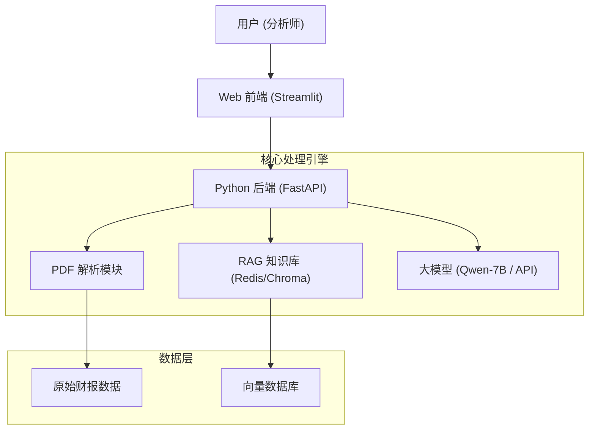

# 金融投研助手 - 需求文档 (PRD)

## 1. 项目背景
在金融行业，分析师每天需要处理海量的财报、新闻和研报。人工阅读效率低，且容易遗漏关键风险点。
本项目旨在利用大模型（LLM）技术，打造一个“**AI 投研助手**”，辅助分析师快速提取关键信息，生成投资建议。

## 2. 核心功能 (MVP)

### 2.1 智能财报分析
*   **输入**：PDF 格式的财报（或长文本）。
*   **处理**：
    *   提取核心财务指标（营收、净利润、毛利率）。
    *   识别管理层讨论与分析（MD&A）中的积极/消极信号。
*   **输出**：一份结构化的“财报速读简报”。

### 2.2 风险预警
*   **输入**：公司新闻、公告。
*   **处理**：利用 NLP 情感分析，识别潜在的暴雷风险（如“诉讼”、“违约”、“立案调查”）。
*   **输出**：风险等级提示（🔴 高危 / 🟡 关注 / 🟢 正常）。

### 2.3 投资建议生成
*   **输入**：上述分析结果 + 市场行情数据（可选）。
*   **处理**：基于预设的投资逻辑模板，让大模型生成一段投资建议草稿。
*   **输出**：一段 200 字左右的投资点评。

## 3. 技术架构 (Week 43-48 规划)

## 4. 交付计划

| 阶段 | 周次 | 核心任务 | 交付物 |
| :--- | :--- | :--- | :--- |
| **P1** | 第43周 | **环境搭建与 PDF 解析** | 能够准确提取 PDF 中的文字和表格 |
| **P2** | 第44周 | **RAG 知识库构建** | 搭建向量数据库，实现“财报问答” |
| **P3** | 第45周 | **Prompt 工程与微调** | 优化 Prompt，使输出符合金融专业话术 |
| **P4** | 第46周 | **前后端开发** | 用 Streamlit 搭建可视化界面 |
| **P5** | 第47周 | **测试与优化** | 邀请 5 位用户测试，收集反馈 |
| **P6** | 第48周 | **文档撰写与结项** | 技术白皮书、演示 PPT |

## 5. 成功标准
1.  **准确率**：核心财务数据提取错误率 < 5%。
2.  **效率**：生成一份简报的时间 < 30秒（人工需要 30分钟）。
3.  **用户满意度**：5 位测试用户评分平均分 > 4.0/5.0。
