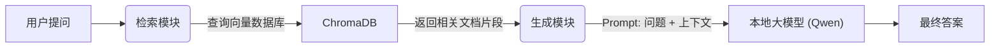

<div style="display: flex; align-items: flex-start; height: 100vh;">

<!-- 左侧目录 (20%宽度, 固定不动) -->
<div style="width: 20%; position: sticky; top: 0; height: 100vh; overflow-y: auto; background-color: #f6f8fa; padding: 20px; border-right: 1px solid #d0d7de; flex-shrink: 0; box-sizing: border-box;">

<h3 style="margin-top: 0;">📚 目录</h3>

1. [项目背景](#1-项目背景)
2. [核心架构 (RAG)](#2-核心架构-rag)
3. [P1: 环境搭建与依赖](#3-p1-环境搭建与依赖)
4. [P2: 数据处理流水线](#4-p2-数据处理流水线)
5. [P3: 向量检索与大模型](#5-p3-向量检索与大模型)
6. [P4: Web 可视化界面](#6-p4-web-可视化界面)
7. [关键问题解决](#7-关键问题解决)
8. [项目成果](#8-项目成果)

</div>

<!-- 右侧正文 (90%宽度, 可滚动) -->
<div style="width: 90%; padding: 20px; overflow-y: auto; height: 100vh; box-sizing: border-box;">

# 第43-48周：金融投研助手 (RAG + Local LLM)

## 1. 项目背景
本阶段的目标是构建一个**行业级解决方案**——金融投研助手。
针对金融行业**数据敏感**、**准确性要求高**的痛点，我们采用了 **RAG (检索增强生成)** 技术结合 **本地化大模型 (Local LLM)**，实现了在不联网、不上传数据的情况下，对 PDF 财报进行智能问答和分析。

## 2. 核心架构 (RAG)
RAG (Retrieval-Augmented Generation) 是目前解决大模型“幻觉”和“知识过时”问题的最佳实践。



## 3. P1: 环境搭建与依赖
我们在 Windows 环境下使用 Python 虚拟环境开发，核心依赖包括：

*   **langchain-text-splitters**: 文本切分
*   **chromadb**: 向量数据库
*   **sentence-transformers**: 向量嵌入模型
*   **modelscope**: 解决国内模型下载问题
*   **streamlit**: Web 界面框架
*   **pdfplumber**: PDF 解析

```bash
pip install chromadb sentence-transformers langchain-text-splitters pdfplumber pandas modelscope streamlit
```

## 4. P2: 数据处理流水线
为了让大模型“读懂”财报，我们需要将 PDF 转换为计算机可理解的向量。

### 4.1 PDF 文本提取
使用 `pdfplumber` 提取文本，并进行简单的清洗（去除页眉页脚）。

```python
# src/pdf_parser.py 核心代码
with pdfplumber.open(pdf_path) as pdf:
    for page in pdf.pages:
        text = page.extract_text()
        if text:
            full_text += text + "\n"
```

### 4.2 文本切分 (Chunking)
使用 LangChain 的 `RecursiveCharacterTextSplitter`。
*   **Chunk Size**: 1000 (每个块的大小)
*   **Overlap**: 200 (重叠部分，防止上下文在切分处断裂)

## 5. P3: 向量检索与大模型

### 5.1 ModelScope 模型下载优化
由于 HuggingFace 国内访问不稳定，我们使用阿里云 ModelScope 下载 `all-MiniLM-L6-v2` 嵌入模型，并将缓存路径指定到 D 盘，避免占用 C 盘空间。

```python
# src/rag_engine.py 设置缓存
os.environ['MODELSCOPE_CACHE'] = 'D:\\ModelScope_Cache'
from modelscope import snapshot_download
model_dir = snapshot_download('AI-ModelScope/all-MiniLM-L6-v2', revision='master')
```

### 5.2 本地 LLM 集成 (llama.cpp)
我们选用了 `Qwen1.5-0.5B-Chat` (通义千问 0.5B) 的 GGUF 量化版本，配合 `llama-server.exe` 运行。
*   **优势**: 极低资源占用，CPU/核显即可流畅运行。
*   **接口**: 提供兼容 OpenAI 格式的本地 API。

## 6. P4: Web 可视化界面
使用 **Streamlit** 快速构建了聊天式界面。
*   **侧边栏**: 设置知识库集合名称。
*   **主界面**: 类似 ChatGPT 的对话窗口，支持流式输出和历史记录保存。

```python
# src/web_ui.py 核心逻辑
if prompt := st.chat_input("请输入问题"):
    # 显示用户提问
    st.session_state.messages.append({"role": "user", "content": prompt})
    # 调用 RAG 引擎
    response = rag_chat(prompt)
    # 显示 AI 回答
    st.markdown(response)
```

## 7. 关键问题解决

### ❓ 问题1: HuggingFace 连接超时
**解决方案**: 切换到 **ModelScope (魔搭社区)** 镜像源，下载速度极快且稳定。

### ❓ 问题2: C 盘空间不足
**解决方案**: 通过设置环境变量 `MODELSCOPE_CACHE`，强制将模型缓存迁移至 D 盘。

### ❓ 问题3: 只有打印没有返回
**解决方案**: 重构 `rag_engine.py`，将原本的 `print()` 输出改为 `return` 字符串，使 Web UI 能获取并显示结果。

## 8. 项目成果
1.  **完整源码**: `src/` 目录下包含解析、检索、UI 所有代码。
2.  **技术文档**: `docs/technical_whitepaper.md` (技术白皮书)。
3.  **演示材料**: `docs/presentation_slides.md` (PPT 大纲)。
4.  **可视化产品**: 一个可运行的 `streamlit` 投研助手应用。

## 9. 项目文件结构说明

### 📂 根目录
*   `requirements.txt`: 项目依赖列表 (Streamlit, ChromaDB, etc.)。
*   `llama_server.log`: LLM 服务运行日志。

### 📂 src/ (源代码)
*   `pdf_parser.py`: **数据解析层**。负责读取 PDF 文件并清洗文本。
*   `rag_engine.py`: **核心引擎层**。包含文本切分 (Chunking)、向量嵌入 (Embedding)、ChromaDB 存储与检索逻辑。
*   `llm_interface.py`: **模型接口层**。自动管理 `llama-server.exe` 进程，提供 Python 调用本地 LLM 的接口。
*   `web_ui.py`: **应用交互层**。基于 Streamlit 的 Web 聊天界面。

### 📂 docs/ (文档)
*   `technical_whitepaper.md`: 技术白皮书，详细介绍架构与部署。
*   `presentation_slides.md`: 演示 PPT 大纲。
*   `需求文档.md`: 初始需求分析。

### 📂 models/ (模型)
*   `qwen1.5-0.5b-chat-q4_k_m.gguf`: 阿里通义千问 0.5B 量化版模型文件。

### 📂 tools/ (工具链)
*   `llama-cpp/`: 包含 `llama-server.exe` 等推理引擎可执行文件。

---

</div>
</div>
