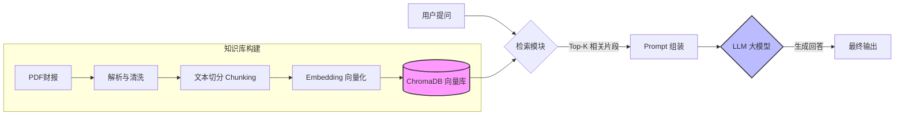

<div style="display: flex; align-items: flex-start; height: 100vh;">

<!-- 左侧目录 (20%宽度, 固定不动) -->
<div style="width: 20%; position: sticky; top: 0; height: 100vh; overflow-y: auto; background-color: #f6f8fa; padding: 20px; border-right: 1px solid #d0d7de; flex-shrink: 0; box-sizing: border-box;">

<h3 style="margin-top: 0;">📚 目录</h3>

1. [项目概览](#1-项目概览)
2. [核心架构 (RAG)](#2-核心架构-rag)
3. [关键技术点](#3-关键技术点)
4. [环境配置与部署](#4-环境配置与部署)
5. [云端与本地双模切换](#5-云端与本地双模切换)
6. [遇到的坑与解决方案](#6-遇到的坑与解决方案)

</div>

<!-- 右侧正文 (90%宽度, 可滚动) -->
<div style="width: 90%; padding: 20px; overflow-y: auto; height: 100vh; box-sizing: border-box;">

# 第43-48周学习笔记：从零构建金融投研助手 (RAG + LLM)

## 1. 项目概览

本项目旨在构建一个**金融投研助手**，能够读取复杂的 PDF 财报（包含大量表格和数据），通过 RAG（检索增强生成）技术，结合大模型回答用户的投资分析问题。

**核心亮点**：
- **双模引擎**：支持纯本地离线运行 (Privacy) 和 云端高性能模式 (Performance) 自由切换。
- **专业财报处理**：针对 PDF 表格进行了特殊的切分优化，避免数据被截断。
- **SOTA 检索**：集成 BGE-M3 模型，支持中英混合高精度检索。

---

## 2. 核心架构 (RAG)

RAG (Retrieval-Augmented Generation) 是目前解决大模型幻觉和知识时效性最主流的技术方案。



### 流程详解
1.  **Indexing (建库)**: 将非结构化的 PDF 转为向量存储。
2.  **Retrieval (检索)**: 将用户问题转为向量，在数据库中寻找余弦相似度最高的片段。
3.  **Generation (生成)**: 将找到的片段作为“上下文(Context)”喂给 LLM，让其基于事实回答。

---

## 3. 关键技术点

### 3.1 PDF 解析与表格处理
普通解析库容易把表格读乱。我们使用了 `pdfplumber` 并配合自定义逻辑。

-   **难点**: 跨页表格、多栏排版。
-   **方案**: 使用 `RecursiveCharacterTextSplitter`，并设置特殊的分隔符（如 `\n\n[Table`）优先在表格边界切分。

### 3.2 向量模型 (Embedding)
选择了 **BGE-M3 (BAAI/bge-m3)**。
-   **BGE**: Beijing Academy of Artificial Intelligence (北京智源人工智能研究院)。
-   **M3**: Multi-Linguality (多语言), Multi-Functionality (多功能), Multi-Granularity (多粒度)。
-   **优势**: 在中文和跨语言检索任务上表现极佳，支持 8192 长度输入。

### 3.3 向量数据库 (ChromaDB)
-   **选择理由**: 轻量级、无需安装 Docker (虽然我们支持 WSL)、纯 Python 实现、易于本地持久化。

### 3.4 LLM 接口抽象
为了支持本地和云端切换，我们设计了统一的接口类。

| 模式 | 模型 | 优点 | 缺点 | 适用场景 |
| :--- | :--- | :--- | :--- | :--- |
| **Local** | Qwen1.5-0.5B | 完全离线，隐私安全，免费 | 逻辑能力弱，易幻觉 | 简单查询，验证流程 |
| **Cloud** | Qwen-Max | 逻辑超强，千亿参数，支持复杂分析 | 需要付费(API Key)，数据需联网 | 深度研报生成，复杂推理 |

---

## 4. 环境配置与部署

### 4.1 依赖安装
```bash
# 核心依赖
pip install langchain chromadb sentence-transformers pdfplumber streamlit dashscope
```
<button onclick="navigator.clipboard.writeText('pip install langchain chromadb sentence-transformers pdfplumber streamlit dashscope')">复制命令</button>

### 4.2 目录结构
```text
project/
├── data/               # 存放 PDF 财报
├── chroma_db/          # 向量数据库持久化文件
├── src/
│   ├── rag_engine.py   # RAG 核心逻辑
│   ├── web_ui.py       # Streamlit 前端
│   ├── pdf_parser.py   # PDF 解析工具
│   └── llm_interface.py # LLM 接口 (Local/Cloud)
├── requirements.txt
└── key.txt             # (可选) 阿里云 API Key
```

---

## 5. 云端与本地双模切换

在 `src/llm_interface.py` 中实现了适配器模式：

```python
# 伪代码示例
class QwenCloudLLM:
    def chat(self, messages, ...):
        import dashscope
        # 调用阿里云 API
        return dashscope.Generation.call(...)

class LocalLLM:
    def chat(self, messages, ...):
        # 调用本地 OpenAI 兼容接口
        requests.post("http://localhost:8000/v1/chat/completions", ...)
```
<button onclick="navigator.clipboard.writeText('...')">复制代码</button>

在前端 `web_ui.py` 中通过 `st.radio` 让用户动态选择，极大提升了系统的灵活性。

---

## 6. 遇到的坑与解决方案

### 🔴 问题1: LLM 幻觉 (胡说八道)
-   **现象**: 询问 Tesla 2023 收入，本地小模型回答了错误的数字。
-   **原因**: 模型参数太小 (0.5B)，记忆力差，且容易受训练数据中过时信息干扰。
-   **解决**:
    1.  **Prompt 约束**: 在 System Prompt 中加入 "严禁编造"、"必须基于上下文" 等强指令。
    2.  **切换模型**: 引入阿里云 Qwen-Max，用大模型解决复杂推理。
    3.  **参数调整**: 将 `temperature` 降至 0.1，`frequency_penalty` 调高。

### � 问题2: 英文财报中文回答
-   **现象**: 检索到的片段是英文，模型直接回英文。
-   **解决**: System Prompt 明确要求 "请理解后用**中文**回答"。

### � 问题3: 下载模型慢
-   **解决**: 使用 `modelscope` (魔搭社区) 替代 HuggingFace，并配置 D 盘缓存目录 `os.environ['MODELSCOPE_CACHE'] = 'D:\\ModelScope_Cache'`。

</div>
</div>
