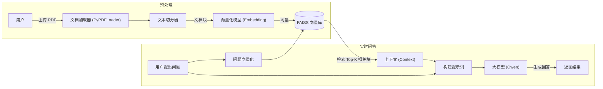

<div style="display: flex; align-items: flex-start;">

<!-- 左侧目录：固定宽度，高度100vh，Sticky定位 -->
<div style="width: 200px; position: sticky; top: 0; height: 100vh; overflow-y: auto; background-color: #f6f8fa; padding: 20px; border-right: 1px solid #d0d7de; flex-shrink: 0;">

<h3 style="margin-top: 0;">📚 目录导航</h3>

1. [核心技术栈](#1-核心技术栈)
2. [系统架构](#2-系统架构-rag-流程)
3. [关键代码解析](#3-关键代码解析)
    - [环境配置](#31-环境配置与依赖)
    - [PDF处理](#32-pdf-文档处理)
    - [向量检索](#33-向量检索-faiss)
    - [Gradio界面](#34-gradio-界面构建)
4. [常见问题](#4-常见问题-troubleshooting)
    - [HF连接超时](#41-hugging-face-连接超时)
    - [构建慢](#42-向量库构建慢)
    - [模型路径](#43-报错-valueerror-unrecognized-model)
5. [学习心得](#5-学习心得)

</div>

<!-- 右侧正文：自适应宽度 -->
<div style="flex-grow: 1; padding: 20px; min-width: 0;">

# 第7-8周：基于 Gradio 的 RAG Web 应用开发

本周目标是整合前面学到的 RAG（检索增强生成）技术，利用 Gradio 框架构建一个可视化的 Web 应用程序，实现“上传 PDF -> 提问 -> 智能回答”的完整流程。

---

## 1. 核心技术栈

- **前端界面**：[Gradio](https://www.gradio.app/) - 快速构建机器学习 Web demo 的 Python 库。
- **大模型**：通义千问 (Qwen-max) - 通过 DashScope API 调用。
- **文档处理**：LangChain - 用于 PDF 加载 (`PyPDFLoader`) 和文本切分 (`RecursiveCharacterTextSplitter`)。
- **向量检索**：
  - **Embedding**：`sentence-transformers/all-MiniLM-L6-v2` (生成文本向量)。
  - **向量库**：FAISS (Facebook AI Similarity Search) - 高效的向量相似度检索库。

---

## 2. 系统架构 (RAG 流程)



---

## 3. 关键代码解析

### 3.1 环境配置与依赖
为了解决国内访问 Hugging Face 即使超时的问题，代码中设置了镜像环境变量：
```python
import os
# 设置 Hugging Face 镜像地址，解决连接超时问题
os.environ["HF_ENDPOINT"] = "https://hf-mirror.com"
```

### 3.2 PDF 文档处理
使用 `PyPDFLoader` 读取文件，并用 `RecursiveCharacterTextSplitter` 进行切分。
- **chunk_size=500**：每块约 500 字符，保证语义相对完整。
- **chunk_overlap=100**：保留 100 字符重叠，防止关键信息被切断。

```python
loader = PyPDFLoader(pdf_path)
docs = loader.load()
splitter = RecursiveCharacterTextSplitter(chunk_size=500, chunk_overlap=100)
chunks = splitter.split_documents(docs)
```

### 3.3 向量检索 (FAISS)
使用 `HuggingFaceEmbeddings` 加载本地或在线模型，将文本块转换为向量并存入 FAISS。
**注意**：`all-MiniLM-L6-v2` 是一个轻量级模型，适合 CPU 运行，支持中英文。

```python
embeddings = HuggingFaceEmbeddings(model_name="sentence-transformers/all-MiniLM-L6-v2")
vectorstore = FAISS.from_documents(chunks, embeddings)
# 检索最相关的 4 个片段
retrieved_docs = vectorstore.similarity_search(question, k=4)
```

### 3.4 Gradio 界面构建
Gradio 通过简单的 API 即可生成交互界面：
- `gr.Interface`：核心类，定义输入、输出和处理函数。
- `inputs`：定义输入组件（如 `gr.Textbox`, `gr.File`）。
- `outputs`：定义输出组件（如 `gr.Textbox`）。

```python
demo = gr.Interface(
    fn=qa,  # 后端处理函数
    inputs=[
        gr.Textbox(label="请输入问题"), 
        gr.File(label="上传 PDF")
    ],
    outputs=gr.Textbox(label="回答")
)
demo.launch()
```

---

## 4. 常见问题 (Troubleshooting)

### 4.1 Hugging Face 连接超时
**现象**：`Connection timed out` 或 `Max retries exceeded`。
**解决**：
1. 设置环境变量 `HF_ENDPOINT` 为 `https://hf-mirror.com`。
2. 或者手动下载模型到本地，将 `model_name` 指向本地文件夹路径。

### 4.2 向量库构建慢
**原因**：每次提问都重新加载 PDF 和构建向量库（当前示例为了逻辑简单而设计）。
**优化方向**：
- 添加**缓存机制**：检查文件名，如果已构建过向量库，直接加载旧的索引。
- **全局变量**：将 `vectorstore` 设为全局变量，仅在文件变化时更新。

### 4.3 报错 `ValueError: Unrecognized model`
**原因**：指定的本地模型路径不完整，缺少 `config.json` 等文件，或者路径指向了缓存的 hash 文件夹而非快照文件夹。
**解决**：
- 确保路径指向包含 `config.json` 的根目录。
- 推荐将模型下载到项目内的 `models/` 目录，使用相对路径引用。

---

## 5. 学习心得
本周打通了从“后端算法”到“前端应用”的最后一公里。通过 Gradio，我们可以快速验证 RAG 算法的效果，并将其分享给他人使用。

</div>
</div>
