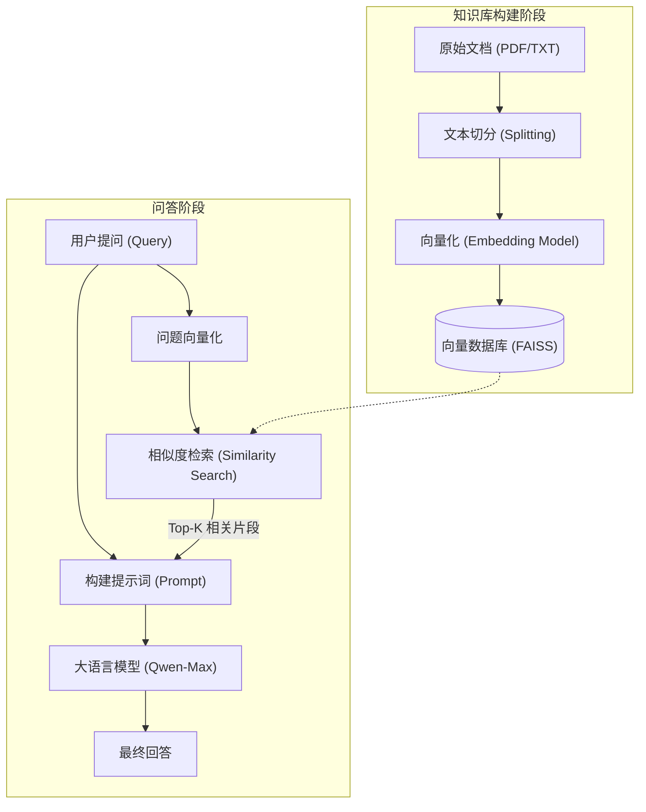
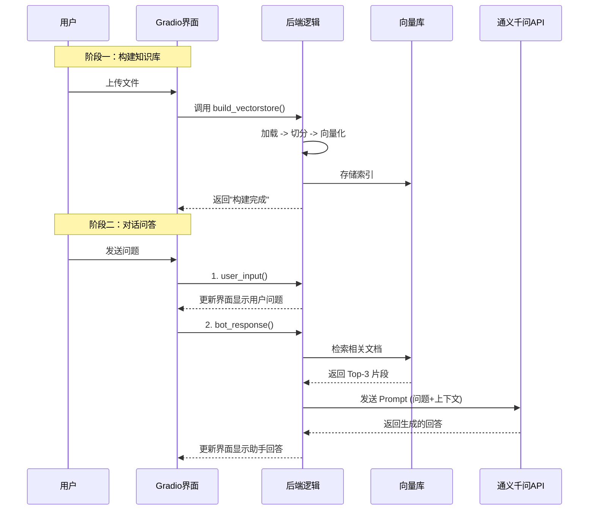
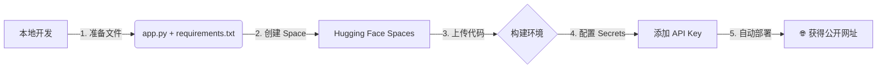

<div style="display: flex; align-items: flex-start;">

<!-- 左侧目录：固定宽度，高度100vh，Sticky定位 -->
<div style="width: 200px; position: sticky; top: 0; height: 100vh; overflow-y: auto; background-color: #f6f8fa; padding: 20px; border-right: 1px solid #d0d7de; flex-shrink: 0;">

<h3 style="margin-top: 0;">📚 目录导航</h3>

1. [项目概述](#1-项目概述)
2. [核心概念](#2-核心概念与技术栈)
3. [系统架构](#3-系统架构与流程可视化)
    - [RAG 原理](#31-rag-工作原理-flowchart)
    - [交互时序](#32-交互时序图-sequence-diagram)
4. [关键代码](#4-关键代码逻辑)
    - [构建](#41-知识库构建-build)
    - [对话](#42-对话处理-chat)
5. [踩坑记录](#5-开发踩坑与解决方案)
    - [Gradio格式](#-坑1gradio-chatbot-数据格式地狱)
    - [HF连接](#-坑2hugging-face-无法下载)
    - [路径转义](#-坑3windows-路径转义)
6. [优化与部署](#6-项目优化与云端部署实战)
    - [提升准确率](#61-提升回答准确率的三个大招)
    - [云端部署](#62-hugging-face-spaces-部署指南)
    - [环境适配](#63-环境自适应代码技巧)
    - [网络问题](#64-部署后的访问问题与对策)

</div>

<!-- 右侧正文：自适应宽度 -->
<div style="flex-grow: 1; padding: 20px; min-width: 0;">

# 第9-12周学习笔记：个人RAG知识库助手开发

## 1. 项目概述
本项目实现了一个基于 **RAG (Retrieval-Augmented Generation，检索增强生成)** 技术的个人知识库助手。
*   **功能**：用户上传 PDF/TXT 文档 -> 系统自动切分并向量化 -> 用户提问 -> 系统检索相关内容并回答。
*   **价值**：解决了大模型无法获取私有数据、知识滞后以及容易产生“幻觉”的问题。

---

## 2. 核心概念与技术栈

| 专有名词 | 英文 | 中文解释 | 功能类比 |
| :--- | :--- | :--- | :--- |
| **RAG** | Retrieval-Augmented Generation | 检索增强生成 | **“开卷考试”**：先翻书（检索）找到答案所在的段落，再根据段落组织语言回答（生成）。 |
| **Embedding** | Text Embedding | 文本嵌入（向量化） | **“翻译官”**：将人类文字翻译成计算机能理解的一串数字（向量）。语义相近的文字，其数字向量在空间上也靠得近。 |
| **Vector Store** | Vector Database | 向量数据库 | **“高维图书馆”**：专门存取这些数字向量的数据库，支持快速查找“长得像”的向量。本项目使用 **FAISS**。 |
| **LangChain** | - | 语言链框架 | **“流水线工人”**：帮你把加载文档、切分、向量化、调用大模型等步骤串联起来的工具库。 |
| **Gradio** | - | 机器学习Web库 | **“装修队”**：几行代码就能搭出一个带输入框、按钮、对话界面的网页。 |

---

## 3. 系统架构与流程可视化

### 3.1 RAG 工作原理 (Flowchart)



### 3.2 交互时序图 (Sequence Diagram)



---

## 4. 关键代码逻辑

### 4.1 知识库构建 (Build)
使用 `LangChain` 的加载器和分割器。
```python
# 1. 加载
if filename.endswith(".pdf"):
    loader = PyPDFLoader(file_path)
docs = loader.load()

# 2. 切分 (针对中文优化：粒度更小，重叠更少)
splitter = RecursiveCharacterTextSplitter(chunk_size=300, chunk_overlap=50)
chunks = splitter.split_documents(docs)

# 3. 向量化存储
# 使用中文优化的 BGE 模型
embeddings = HuggingFaceEmbeddings(model_name="BAAI/bge-small-zh-v1.5")
vectorstore = FAISS.from_documents(chunks, embeddings)
```

### 4.2 对话处理 (Chat)
Gradio 的 `type="messages"` 模式下的数据处理。
```python
def qwen_chat(message, history):
    # 防御性处理：Gradio 有时会把 message 包装成 list
    if isinstance(message, list) and len(message) > 0:
        message = message[0]
    
    # 1. 检索 (k=5 提供更多上下文)
    docs = global_vectorstore.similarity_search(message, k=5)
    context = "\n".join([d.page_content for d in docs])
    
    # 2. 拼接 Prompt (强化约束)
    prompt = f"参考资料：\n{context}\n\n问题：{message}\n\n请仅依据参考资料回答..."
    
    # 3. 调用 API
    return Generation.call(model="qwen-max", prompt=prompt)
```

---

## 5. 开发踩坑与解决方案

### 🔴 坑1：Gradio Chatbot 数据格式地狱
*   **现象**：报错 `Data incompatible with messages format` 或 `'list' object has no attribute 'replace'`。
*   **原因**：Gradio 4.x/5.x 版本更新频繁，`Chatbot` 组件在不同配置下对数据格式要求极严。
*   **完美解决方案**：
    1.  初始化时**不指定** `type` 参数（让它自适应）。
    2.  代码中强制构造 **字典列表** 格式。
    3.  后端接收时做 **类型检查**（防止传入 List）。

### 🔴 坑2：Hugging Face 无法下载
*   **现象**：`ConnectionError` 或下载进度卡死。
*   **原因**：国内网络环境无法直接连接 HF 官网。
*   **解决方案**：
    ```python
    import os
    os.environ["HF_ENDPOINT"] = "https://hf-mirror.com"
    ```

### 🔴 坑3：Windows 路径转义
*   **现象**：`SyntaxError: (unicode error) 'unicodeescape' codec can't decode...`
*   **原因**：Windows 路径中的 `\` 被当成了转义字符（如 `\u`）。
*   **解决方案**：
    *   使用原始字符串：`r"C:\Users\..."`
    *   或使用正斜杠：`"C:/Users/..."`

---

## 6. 项目优化与云端部署实战

### 6.1 提升回答准确率的三个大招
在项目验收时，如果发现回答不够准确（比如低于 70%），可以通过以下三步优化：

| 优化维度 | 原始方案 | 优化方案 | 原理 |
| :--- | :--- | :--- | :--- |
| **Embedding 模型** | `all-MiniLM-L6-v2` | **`BAAI/bge-small-zh-v1.5`** | 原模型对英文支持好，但对中文理解很差；BGE 是目前最强的开源中文嵌入模型之一。 |
| **切分参数** | `chunk_size=500` | **`chunk_size=300`** | 中文信息密度大，减小切分粒度可以减少“杂音”，让检索更精准。 |
| **Prompt** | 简单指令 | **强约束指令** | 明确要求“仅依据参考资料”、“找不到就说不知道”，防止大模型产生幻觉。 |

### 6.2 Hugging Face Spaces 部署指南
Hugging Face 提供免费的服务器空间，非常适合托管个人展示项目。



**关键操作：**
1.  **创建 Space**：SDK 选择 **Gradio**，模板选择 **Blank**。
2.  **设置密钥**：在 Settings -> Variables and secrets 中添加 `DASHSCOPE_API_KEY`。
3.  **休眠机制**：免费版 48 小时无访问会自动休眠，下次访问时需等待 1-2 分钟唤醒。

除了 Hugging Face，还有以下几个对 Python/Gradio 友好的免费平台：

| 平台 | 免费额度/特点 | 适合场景 | 缺点 |
| :--- | :--- | :--- | :--- |
| **Streamlit Cloud** | **永久免费**，不休眠 | 纯数据面板 | 不支持 Gradio |
| **Render** | 15分钟无访问休眠 | Docker 全栈 | 唤醒慢，限制多 |
| **Zeabur** | 少量免费额度，国内秒开 | 各种语言 | 额度少，需绑卡 |
| **Vercel** | **永久免费**，极速 | 前端/Node.js | 对 Python 支持弱 |

### 6.3 环境自适应代码技巧


```python
# 核心技巧：判断环境变量
if "HUGGINGFACE_SPACES" not in os.environ:
    # 只有在本地（没有这个变量）时，才启用国内镜像
    os.environ["HF_ENDPOINT"] = "https://hf-mirror.com"

# 使用模型 ID 而非绝对路径，支持自动下载
MODEL_PATH = "BAAI/bge-small-zh-v1.5" 
```

### 6.4 部署后的访问问题与对策
*   **问题**：Hugging Face 官网 (`huggingface.co`) 在国内经常被墙，导致部署好的网址无法直接打开。
*   **对策 1 (推荐)**：将链接中的域名替换为镜像域名 `hf-mirror.com` 发给面试官。
*   **对策 2 (保底)**：**录制演示视频**（Win+G 或 OBS），上传到 B 站或 GitHub，作为项目无法访问时的备选展示。
*   **对策 3 (进阶)**：使用 **Zeabur** 等对国内网络友好的平台进行部署。

</div>
</div>
