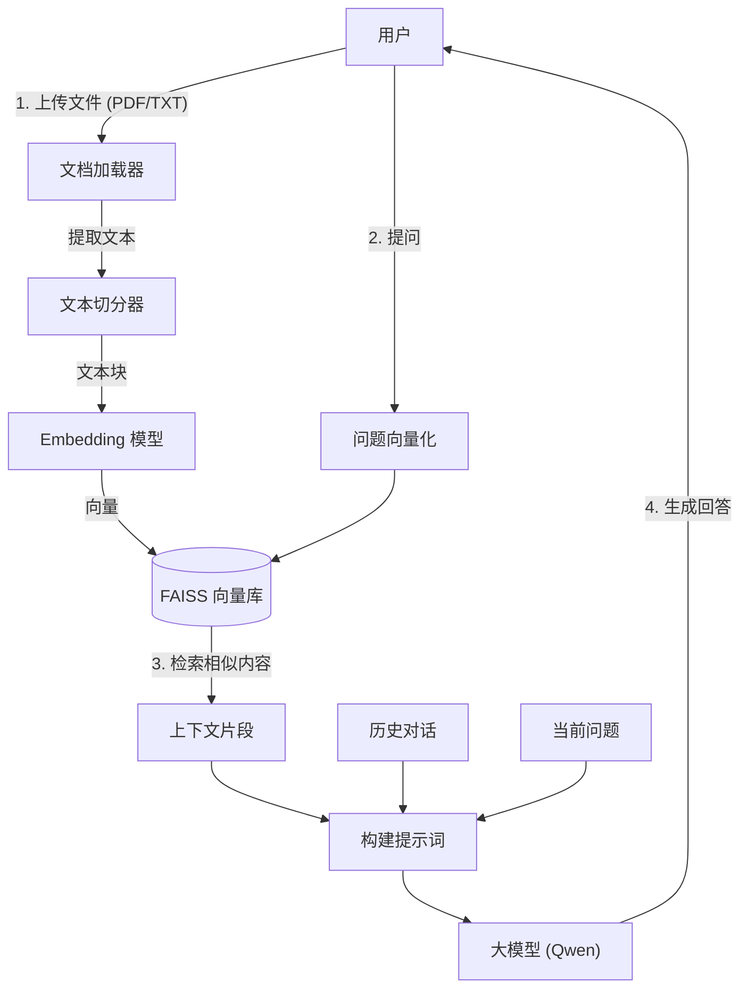

<div style="display: flex; align-items: flex-start;">

<!-- 左侧目录：固定宽度，高度100vh，Sticky定位 -->
<div style="width: 200px; position: sticky; top: 0; height: 100vh; overflow-y: auto; background-color: #f6f8fa; padding: 20px; border-right: 1px solid #d0d7de; flex-shrink: 0;">

<h3 style="margin-top: 0;">📚 目录导航</h3>

1. [架构设计](#1-系统架构设计)
2. [环境准备](#2-本地开发环境准备)
    - [项目文件](#21-创建项目文件)
    - [依赖配置](#22-编写依赖文件-requirementstxt)
3. [代码实现](#3-核心代码实现-apppy)
    - [完整代码](#31-完整代码)
4. [本地测试](#4-本地测试步骤)
5. [云端部署](#5-部署到-hugging-face-spaces)
    - [创建Space](#51-创建-space)
    - [上传代码](#52-上传代码-git-方式)
6. [验收自测](#6-验收标准自测)

</div>

<!-- 右侧正文：自适应宽度 -->
<div style="flex-grow: 1; padding: 20px; min-width: 0;">

# 第9-12周：个人知识库助手开发与部署指南

本指南将指导你一步步完成“个人知识库助手”的开发，支持多格式文档上传、问答历史记录，并最终部署到 Hugging Face Spaces。

---

## 1. 系统架构设计

我们使用 RAG (Retrieval-Augmented Generation，检索增强生成) 技术架构。

**专有名词解释**：
- **RAG**: 结合了“检索系统”和“生成模型”的技术。先从你的文档里搜答案，再让 AI 组织语言回答你。
- **Embedding (嵌入)**: 把文字变成计算机能理解的一串数字（向量）。
- **Vector Database (向量库)**: 专门存这些数字向量的数据库，用来快速找相似的内容。这里我们用 FAISS。



---

## 2. 本地开发环境准备

### 2.1 创建项目文件
在 `F:\Desktop\个人资料\大模型学习项目\第9_12周\` 目录下，我们需要两个核心文件：
1.  `requirements.txt`: 记录项目需要的 Python 库。
2.  `app.py`: 项目的主程序代码。

### 2.2 编写依赖文件 `requirements.txt`
新建 `requirements.txt`，内容如下：

```text
gradio>=4.0.0
langchain
langchain-community
langchain-huggingface
dashscope
faiss-cpu
pypdf
sentence-transformers
# 解决字符编码和部分加载问题
chardet
```

**说明**：
- `gradio`: 用于创建网页界面。
- `faiss-cpu`: Facebook 开源的高效向量检索库（CPU版）。
- `dashscope`: 阿里云通义千问的 SDK。

---

## 3. 核心代码实现 (`app.py`)

新建 `app.py`，我们将代码分为三个部分：**配置与初始化**、**RAG 逻辑**、**Gradio 界面**。

### 3.1 完整代码
请将以下代码复制到 `app.py` 中。代码已包含多文件支持和历史记录功能。

```python
import os
import gradio as gr
from dashscope import Generation
from langchain_community.document_loaders import PyPDFLoader, TextLoader
from langchain_text_splitters import RecursiveCharacterTextSplitter
from langchain_community.embeddings import HuggingFaceEmbeddings
from langchain_community.vectorstores import FAISS
from http import HTTPStatus

# ========== 配置部分 ==========
# 1. 设置 HF 镜像，防止模型下载超时
os.environ["HF_ENDPOINT"] = "https://hf-mirror.com"

# 2. 模型路径配置 (使用你本地已下载的模型路径，或保持默认自动下载)
# 建议将第7-8周下载好的 models 文件夹复制过来，或者指向绝对路径
# 这里使用相对路径，请确保项目根目录下有 models/all-MiniLM-L6-v2
MODEL_PATH = "sentence-transformers/all-MiniLM-L6-v2"

# 全局变量：用于存储构建好的向量库
global_vectorstore = None

# ========== 核心逻辑 ==========

def load_and_split_files(file_objs):
    """
    加载并切分上传的文件。
    支持 PDF 和 TXT。
    """
    all_chunks = []
    
    if not file_objs:
        return []

    for file_obj in file_objs:
        # Gradio 4.x 传入的是文件对象列表，file_obj.name 是临时文件路径
        file_path = file_obj.name
        filename = os.path.basename(file_path)
        print(f"[System] 正在处理文件: {filename}")
        
        # 根据后缀选择加载器
        if filename.lower().endswith(".pdf"):
            loader = PyPDFLoader(file_path)
        elif filename.lower().endswith(".txt"):
            loader = TextLoader(file_path, encoding="utf-8", autodetect_encoding=True)
        else:
            print(f"[System] 跳过不支持的文件格式: {filename}")
            continue

        docs = loader.load()
        
        # 切分文本
        splitter = RecursiveCharacterTextSplitter(
            chunk_size=500,
            chunk_overlap=100
        )
        chunks = splitter.split_documents(docs)
        all_chunks.extend(chunks)
        
    return all_chunks

def build_vectorstore(file_objs):
    """
    根据上传的文件构建向量库。
    """
    global global_vectorstore
    
    chunks = load_and_split_files(file_objs)
    if not chunks:
        return "⚠️ 未提取到有效文本，请检查文件格式。"

    print(f"[System] 共切分出 {len(chunks)} 个文本块，开始构建向量库...")
    
    # 初始化 Embedding 模型
    embeddings = HuggingFaceEmbeddings(model_name=MODEL_PATH)
    
    # 构建 FAISS 索引
    global_vectorstore = FAISS.from_documents(chunks, embeddings)
    
    return f"✅ 知识库构建完成！共处理 {len(chunks)} 个片段。现在可以开始提问了。"

def qwen_chat(message, history):
    """
    处理用户提问（支持多轮对话）。
    message: 当前用户输入
    history: 历史对话列表 [[user_msg, bot_msg], ...]
    """
    global global_vectorstore
    
    if not os.environ.get("DASHSCOPE_API_KEY"):
        return "❌ 请先设置 DASHSCOPE_API_KEY 环境变量。"
    
    if global_vectorstore is None:
        return "⚠️ 请先上传文件并等待知识库构建完成。"

    # 1. 检索相关文档
    try:
        retrieved_docs = global_vectorstore.similarity_search(message, k=3)
        context = "\n\n".join([doc.page_content for doc in retrieved_docs])
    except Exception as e:
        return f"检索出错: {str(e)}"

    # 2. 构建 Prompt (包含历史记录摘要，这里简化处理，主要依赖当前上下文)
    # 将最近 2 轮历史对话拼接入 Prompt 以保持连贯性
    history_str = ""
    for user_msg, bot_msg in history[-2:]:
        history_str += f"用户: {user_msg}\n助手: {bot_msg}\n"

    prompt = f"""
你是一个专业的知识库助手。请根据以下参考资料回答用户问题。

【参考资料】
{context}

【历史对话】
{history_str}

【用户当前问题】
{message}

请注意：
1. 仅依据参考资料回答，如果资料中没有答案，请直接说“资料中未提及”。
2. 回答要条理清晰。
"""

    # 3. 调用 Qwen API
    try:
        response = Generation.call(
            model="qwen-max",
            api_key=os.environ.get("DASHSCOPE_API_KEY"),
            prompt=prompt
        )
        
        if response.status_code == HTTPStatus.OK:
            return response.output.text
        else:
            return f"API 调用失败: {response.message}"
            
    except Exception as e:
        return f"发生错误: {str(e)}"

# ========== Gradio 界面 ==========

with gr.Blocks(title="个人知识库助手") as demo:
    gr.Markdown("# 📚 个人 RAG 知识库助手")
    gr.Markdown("支持上传 PDF/TXT 文件，构建专属知识库并进行问答。")
    
    with gr.Row():
        with gr.Column(scale=1):
            # 文件上传区
            file_input = gr.File(
                label="1. 上传文档 (支持多选)", 
                file_count="multiple",
                file_types=[".pdf", ".txt"]
            )
            upload_btn = gr.Button("🚀 构建知识库", variant="primary")
            status_output = gr.Textbox(label="系统状态", interactive=False)
            
        with gr.Column(scale=2):
            # 聊天区
            chatbot = gr.Chatbot(height=500, label="对话记录")
            msg_input = gr.Textbox(label="2. 输入问题", placeholder="关于文档内容的提问...")
            clear_btn = gr.Button("🗑️ 清空对话")

    # 事件绑定
    upload_btn.click(
        fn=build_vectorstore,
        inputs=[file_input],
        outputs=[status_output]
    )
    
    msg_input.submit(
        fn=qwen_chat,
        inputs=[msg_input, chatbot],
        outputs=[msg_input, chatbot]  # 这种写法在 Gradio 旧版常用，新版推荐用 ChatInterface，但 Blocks 更灵活
    ).then(
        # 模拟流式输出或更新 Chatbot，这里简化为非流式更新
        lambda user_msg, history: history + [[user_msg, qwen_chat(user_msg, history)]],
        inputs=[msg_input, chatbot],
        outputs=[chatbot]
    )

if __name__ == "__main__":
    demo.launch()
```

---

## 4. 本地测试步骤

1.  **安装依赖**：
    在终端运行：`pip install -r requirements.txt`
2.  **设置 API Key**：
    Windows Powershell: `$env:DASHSCOPE_API_KEY="你的Key"`
3.  **准备模型**：
    确保代码中的 `MODEL_PATH` 指向有效的模型路径（如果本地没有，代码默认会尝试联网下载，但最好配好镜像）。
4.  **运行应用**：
    `python app.py`
5.  **浏览器访问**：
    打开 `http://127.0.0.1:7860`。上传一个 PDF，点击构建，然后提问测试。

---

## 5. 部署到 Hugging Face Spaces

这是将你的项目发布到互联网的关键步骤。

### 5.1 创建 Space
1.  注册/登录 [Hugging Face](https://huggingface.co/)。
2.  点击头像 -> **New Space**。
3.  **Name**: `knowledge-assistant` (自取)。
4.  **License**: `MIT`。
5.  **SDK**: 选择 **Gradio**。
6.  点击 **Create Space**。

### 5.2 上传代码 (Git 方式)
在本地终端执行以下命令（假设你已经安装了 Git）：

```bash
# 1. 初始化 Git 仓库 (如果还没初始化)
git init

# 2. 关联远程仓库 (替换 <username> 为你的 HF 用户名)
git remote add origin https://huggingface.co/spaces/<username>/knowledge-assistant

# 3. 添加文件
git add requirements.txt app.py

# 4. 提交
git commit -m "Initial deploy"

# 5. 推送 (需要输入 HF 的 Token 作为密码)
git push -u origin main
```

**重要**：
- Hugging Face Spaces 无法直接读取你本地的 `.env` 或环境变量。
- 你需要在 Space 的网页设置页 (**Settings** -> **Variables and secrets**) 中，添加 `DASHSCOPE_API_KEY`，填入你的 Key。

---

## 6. 验收标准自测

- [ ] **代码完整性**：本地能跑通，无语法错误。
- [ ] **云端访问**：通过 Hugging Face 提供的 URL (如 `huggingface.co/spaces/...`) 能打开网页。
- [ ] **功能测试**：
    1. 上传《编译原理》试题 PDF。
    2. 提问：“这门课的考试时间是多少？”
    3. AI 能准确回答文档里的时间。
    4. 继续问：“那考试地点呢？”（测试多轮对话/上下文）。

</div>
</div>
